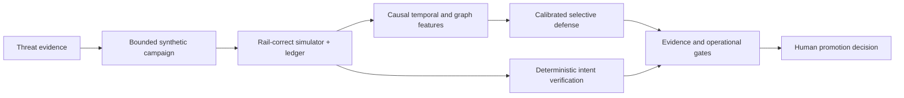

# APAR — Adaptive Payment Assurance Range

**Assure the campaign. Verify the intent. Promote only the evidence.**

APAR is a pre-production payment-security range for the Mastercard Innovation
Challenge 2026. It converts emerging AI-enabled fraud threats into bounded,
replayable campaigns; executes them across card, account-to-account, and
agentic-payment rails; compares defenses; and preserves a human decision before
any control is promoted.

[**Open the public prototype**](https://web-six-tau-bxhm7rwrzu.vercel.app/overview)
· [Pitch deck](docs/submission/APAR_COMPETITION_DECK.pdf)
· [Kaggle submission write-up](docs/submission/KAGGLE_SUBMISSION_WRITEUP.md)
· [Five-minute walkthrough](MOBILE_VIDEO_SCRIPT.md)


> [!IMPORTANT]
> APAR uses synthetic data only. The public Vercel site is a static,
> hash-verified replay; it does not run Python. The repository's local console
> runs the packaged `ensemble_with_graph` scorer. Reported comparison metrics
> are verified synthetic diagnostics, not production or external-validation
> estimates.

## Why APAR

Generative AI changes the economics of payment fraud: attackers can personalize
social engineering, coordinate mule networks, probe controls, and act through
delegated software faster than static rules can adapt. A transaction-only score
misses much of that behavior.

APAR changes the unit of assurance from a single transaction to the complete
campaign:



## What the working prototype demonstrates

- **Campaign simulation:** deterministic card, A2A, and agentic-payment
  lifecycles with event-time ordering and ledger conservation.
- **Four fraud families:** APP scam/mule, card testing CNP, synthetic
  merchant/refund abuse, and agentic intent abuse.
- **Campaign-aware defense:** a portable three-member calibrated CatBoost
  ensemble over 46 frozen, past-only velocity, amount, pair-history,
  data-quality, and graph features.
- **Selective actions:** approve, challenge, review-hold, or decline-hold,
  evaluated with customer-friction and operational-capacity measures—not recall
  alone.
- **Verifiable agentic intent:** deterministic checks for agent identity, user
  mandate, scope, merchant/cart binding, expiry, nonce, and replay before
  statistical risk.
- **Auditable evidence:** content-addressed artifacts, tamper and leakage tests,
  rejected-experiment records, hash-bound fallback traces, and a human
  promotion boundary.

## What the experiments taught us

Rules alone detected fraud but created severe benign friction. A calibrated
non-graph ensemble was strong; causal graph context provided the best overall
precision/recall/friction balance. The selected `ensemble_with_graph` arm
produced the following recovered diagnostics on the synthetic development
corpus:

| Metric | Result |
|---|---:|
| Recall | 99.87% |
| Precision | 95.88% |
| F1 | 97.83% |
| False-decline rate | 0.0037% |
| Challenge rate | 0.572% |
| p95 scoring latency | 3.54 ms |

These results are deliberately labelled **verified synthetic diagnostics**.
They establish the direction of the architecture comparison; they do not
establish production readiness, real-world prevalence, or performance on
Mastercard/cardholder data.

## Explore the public prototype

The [Vercel deployment](https://web-six-tau-bxhm7rwrzu.vercel.app/overview)
contains six judge-facing routes:

| Route | What to inspect |
|---|---|
| [Overview](https://web-six-tau-bxhm7rwrzu.vercel.app/overview) | Problem, payment contexts, and evidence boundary |
| [Scenario](https://web-six-tau-bxhm7rwrzu.vercel.app/scenario) | Bounded campaign and synthetic controls |
| [Replay](https://web-six-tau-bxhm7rwrzu.vercel.app/replay) | Probabilities, actions, reason codes, and verified fallback |
| [Investigation](https://web-six-tau-bxhm7rwrzu.vercel.app/investigation) | Connected campaign graph instead of isolated alerts |
| [Defenses](https://web-six-tau-bxhm7rwrzu.vercel.app/defenses) | Rules, non-graph, and graph architecture comparison |
| [Assurance](https://web-six-tau-bxhm7rwrzu.vercel.app/assurance) | Intent verification, hashes, controls, and human gate |

## Run the real packaged scorer locally

Requirements: Python 3.12 and Node.js/npm. From a clean clone:

```bash
python3.12 -m venv .venv
.venv/bin/python -m pip install -e '.[dev]'
npm ci --prefix web
.venv/bin/python scripts/run_apar_console.py health
.venv/bin/python scripts/run_apar_console.py start
```

Open `http://127.0.0.1:4173/overview`. Before describing the Python model as
running, confirm that the interface displays **Local scorer · verified**. The
launcher verifies the packaged model, scenario record, predictions, and
fallback trace before serving the console.

For a CLI-only replay:

```bash
.venv/bin/python scripts/run_sentinel_v5_demo.py \
  --scenario demo/sentinel-v5/scenarios.json
```

## Reproducibility and documentation

- [Competition traceability](docs/submission/COMPETITION_TRACEABILITY.md)
- [Research and experiment journey](docs/submission/RESEARCH_AND_EXPERIMENT_JOURNEY.md)
- [Model card](docs/submission/MODEL_CARD.md)
- [Data and simulation card](docs/submission/DATA_AND_SIMULATION_CARD.md)
- [Evaluation and limitations](docs/submission/EVALUATION_AND_LIMITATIONS.md)
- [Commercial and deployment plan](docs/submission/COMMERCIAL_AND_DEPLOYMENT_PLAN.md)
- [Clean-room release checklist](docs/submission/RELEASE_CHECKLIST.md)
- [Third-party notices](docs/submission/THIRD_PARTY_NOTICES.md)

The release tooling builds an allowlisted archive, scans for secrets and PII
patterns, installs it in a clean temporary environment, rebuilds the frontend,
and replays all 12 bound demonstration cases. No real cardholder data, API key,
cloud service, or database is required for local replay after dependencies are
installed.

## Team

**LedgerPe Labs** · Mastercard Innovation Challenge 2026

The prototype is research and competition software for synthetic,
pre-production assurance. It is not a production payment-decision service.
