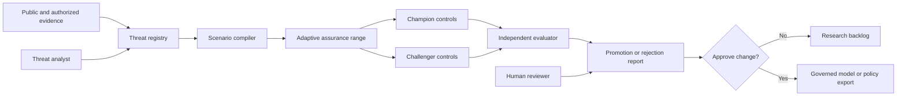
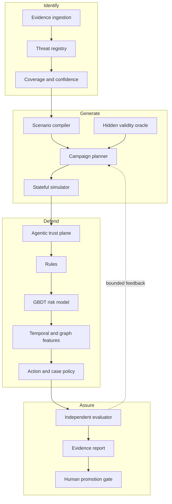
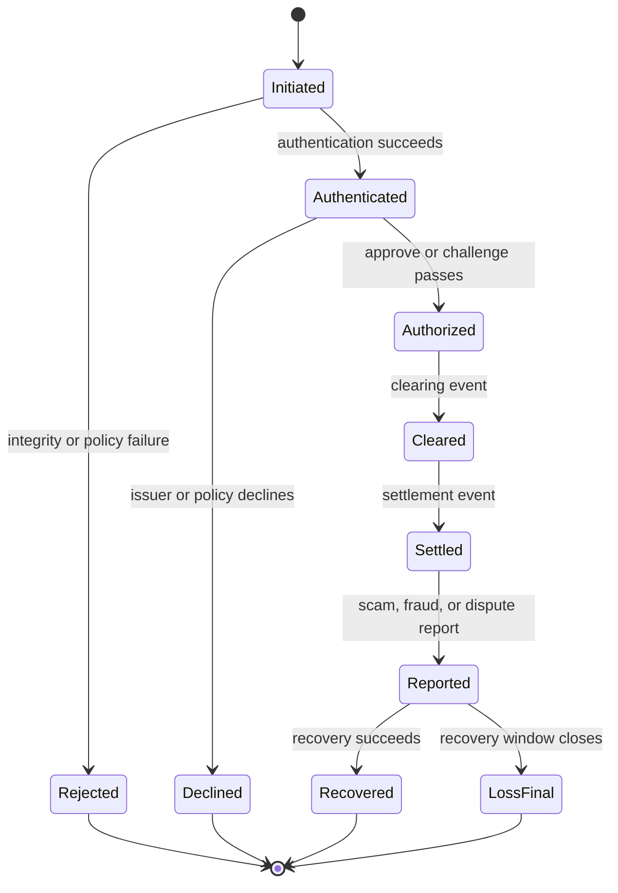

# Adaptive Payment Assurance Range

## Solution specification

**Competition:** Mastercard Innovation Challenge 2026  
**Document status:** Approved target architecture  
**Version:** 1.1  
**Date:** 16 August 2026  
**Primary audience:** Competition judges, product owners, fraud data scientists, threat-intelligence teams, investigators, security architects, and model-risk reviewers

## 1. Executive decision

Build a pre-production adversarial assurance range that answers one question:

> Will payment controls remain effective when GenAI changes the attacker’s speed, personalization, coordination, autonomy, or ability to manipulate delegated payment intent?

The system shall:

1. Identify emerging GenAI-enabled payment threats from evidence.
2. Compile selected threats into bounded, economically valid synthetic campaigns.
3. Replay campaigns through rail-correct payment lifecycles.
4. Evaluate deterministic controls, rules, transaction models, temporal features, and graph features.
5. Let a bounded attacker adapt using only declared decision feedback.
6. Reject unrealistic or unsafe attack candidates through a hidden validity oracle.
7. Evaluate frozen defenses on a separately implemented hidden generator.
8. Produce an auditable champion/challenger promotion report for human approval.

The system shall not target live payment systems, ingest unauthorized personal data, automatically deploy a model, or export operational attack instructions.

## 2. Product thesis

Most competition entries are likely to focus on one of three familiar patterns:

- An LLM that lists fraud scenarios.
- A synthetic tabular generator.
- A transaction classifier with a dashboard.

The proposed product is different. It treats fraud defense as a continuously tested control system. The primary innovation is the closed assurance loop across evidence, campaign simulation, adaptive evasion, hidden evaluation, and governed promotion.

The most defensible claim is:

> We do not claim to identify whether a scam message was authored by AI. We measure the operational capability GenAI gives the attacker, reproduce its downstream payment behavior safely, and verify that payment controls remain effective under hidden campaign shifts.

## 3. Competition traceability

| Competition need | Product response | Primary evidence |
|---|---|---|
| Identify novel attacks | Evidence-backed threat registry with 20-30 threat cards, confidence, provenance, and GenAI capability deltas | Threat registry, evidence ledger, coverage report |
| Generate realistic simulations | Stateful, rail-specific campaign simulator with lifecycle, balances, constraints, and deterministic replay | Scenario bundle, event stream, conservation checks |
| Defend accurately | Layered controls, strong baselines, campaign grouping, reason codes, and action policy | Evaluation report and replay dashboard |
| Low false positives | Fixed operational budgets, per-action thresholds, calibration, and capacity-aware evaluation | False positives per 10,000, false declines, challenge and review rates |
| Novelty | Adaptive campaign assurance plus agentic-intent integrity testing | Optimizer ablation and agentic attack suite |
| Real-world feasibility | Mastercard-view data contract, rail adapters, lifecycle ownership, latency benchmark | Architecture, schemas, benchmark report |
| Presentation | Five-minute deterministic web walkthrough and downloadable promotion report | Prototype and walkthrough document |

## 4. Goals and non-goals

### 4.1 Goals

- Cover GenAI-enabled fraud broadly in the identification layer.
- Implement a small number of scenarios with high causal and payment fidelity.
- Demonstrate a measurable GenAI capability delta.
- Demonstrate adaptive search against a frozen defender.
- Separate development simulation from hidden evaluation.
- Measure preventable value, customer harm, investigation burden, and time to alert.
- Include one executable agentic-commerce integrity scenario.
- Run locally and deterministically for judging.
- Preserve evidence, configuration, prompts, model versions, seeds, and outputs.

### 4.2 Non-goals

- Replacing Mastercard or issuer production fraud systems.
- Proving production-scale throughput in the competition prototype.
- Determining whether content itself was generated by AI.
- Building a complete card-network, A2A, or agent-commerce protocol.
- Automatically promoting or deploying defense changes.
- Generating instructions suitable for attacking live systems.
- Claiming that same-code synthetic evaluation is independent external validation.

## 5. Users and jobs

| User | Primary job | Product outcome |
|---|---|---|
| Threat-intelligence analyst | Convert emerging evidence into testable payment threats | Structured, reviewable threat cards |
| Fraud data scientist | Compare champion and challenger controls | Reproducible evaluation under known and hidden campaigns |
| Model-risk reviewer | Challenge assumptions, leakage, calibration, and promotion evidence | Signed evidence pack and pass/fail gates |
| Payment product owner | Understand customer friction and value impact | Action-level cost and benefit frontier |
| Investigator | See linked activity as cases, not isolated transactions | Campaign graph, reason codes, entity coverage |
| Security architect | Validate delegated-payment integrity | Deterministic agentic verification and audit chain |
| Competition judge | Understand the value in five minutes | One coherent end-to-end walkthrough |

## 6. System context



## 7. Logical architecture

The system has eight bounded components.

### 7.1 Evidence and threat registry

Maintains sourced threat cards, evidence quality, affected rails, attack stages, GenAI capability deltas, observables, simulation support, safety classification, and confidence.

### 7.2 Scenario compiler

Transforms an approved threat card plus scenario configuration into a versioned, typed scenario bundle. It rejects missing constraints, unsupported rail semantics, unsafe exports, and ambiguous decision-time data.

### 7.3 Stateful payment simulator

Produces synthetic payment and control events with explicit event time, arrival time, decision time, authorization state, settlement state, balances, entities, and campaign causality. Rail adapters implement card, A2A, and agentic-commerce semantics.

### 7.4 Adaptive campaign planner

Proposes campaign parameters under a fixed query budget and bounded decision feedback. It cannot access model internals, hidden constraints, labels, or future events.

### 7.5 Layered defense plane

Runs deterministic integrity checks, policy rules, transaction/entity models, temporal and graph features, campaign grouping, and an operational action policy.

### 7.6 Agentic trust plane

Verifies registered agent identity, signed mandate, merchant and cart binding, credential scope, consent, nonce, expiry, and execution receipt before ML risk scoring.

### 7.7 Independent evaluator

Calculates per-family, per-segment, value, workload, calibration, leakage, and latency metrics. It enforces promotion gates and cannot be modified by the candidate model.

### 7.8 Product and governance layer

Provides the web walkthrough, evidence inspection, scenario configuration, replay, campaign visualization, champion/challenger comparison, audit log, and signed human decision.



## 8. Threat portfolio

### 8.1 Identification breadth

The threat registry shall contain at least 20 reviewed threat cards across:

- Credential and account compromise.
- Card-not-present and card-testing campaigns.
- Authorized push-payment scams.
- Mule recruitment, aggregation, layering, and cash-out.
- Synthetic identity and onboarding abuse.
- Merchant, refund, dispute, and promotion abuse.
- Deepfake-assisted social engineering.
- AI-scaled multilingual personalization.
- Autonomous reconnaissance and campaign adaptation.
- Agentic-commerce prompt injection and delegated-intent abuse.
- Token, mandate, replay, merchant, payee, amount, and cart substitution.
- Cross-channel campaigns that join communication, identity, account, device, merchant, and payment behavior.

Each card shall distinguish observed evidence from hypothesized future capability.

### 8.2 Executable depth

The competition prototype shall deeply implement four scenario families:

1. **AI-personalized APP scam and mule network**  
   Heterogeneous victim-authorized payments appear individually plausible but converge on coordinated receiving entities and cash-out paths.

2. **Adaptive card-testing or CNP campaign**  
   The attacker changes pacing, amount, merchant distribution, device reuse, and retry behavior using bounded decisions.

3. **Synthetic merchant, refund, or identity abuse**  
   Generated identities and merchant behaviors evolve across onboarding, transaction, dispute, and payout stages.

4. **Agentic-commerce intent abuse**  
   Prompt injection, mandate violation, merchant substitution, cart mutation, replay, and token-scope abuse are evaluated against deterministic trust controls.

Every executable scenario requires a static non-GenAI control, random-search control, adaptive non-LLM control, and GenAI/agent planner variant where applicable.

## 9. Scenario and simulation requirements

### 9.1 Scenario bundle

A scenario bundle shall contain:

- `scenario_id` and semantic version.
- Linked threat-card version.
- Target rail and observation viewpoint.
- Attacker objectives and permitted capabilities.
- Population, entity, and benign-behavior configuration.
- Campaign stages and transition rules.
- Economic constraints and cost model.
- Authentication, authorization, settlement, recovery, and label-delay rules.
- GenAI capability flags.
- Defender knowledge boundary.
- Hidden validity constraints.
- Random seeds and deterministic replay manifest.
- Safety classification and export restrictions.

### 9.2 Payment lifecycle

Every payment attempt shall transition through explicit states:



### 9.3 Conservation and causality

- No account may transfer more settled funds than its available balance unless an explicit credit facility exists.
- Every downstream mule outflow must reference upstream settled inflows.
- Failed and reversed payments must not fund cash-out.
- Deleting an upstream event must invalidate dependent downstream behavior.
- Every feature must reference source event IDs with decision-available timestamps.
- Event time, ingestion time, feature time, and decision time must be separate fields.

### 9.4 Benign realism

Benign behavior shall include shared devices, legitimate shared beneficiaries, travel, seasonal changes, payroll cycles, retries, duplicates, missing fields, out-of-order events, new entities, merchant promotions, foreign exchange, and changing channel use. Benign novelty must sometimes resemble attack novelty.

## 10. Adaptive red-team protocol

### 10.1 Attacker observation boundary

The adaptive planner may observe only a configured subset of:

- Approve, challenge, decline, or delayed outcome.
- Coarse reason category if exposed in the experiment.
- Realized authorized value.
- Campaign time and its own resource usage.

It may not observe model scores, gradients, labels, hidden validity checks, future transactions, or defender state unless explicitly included in a separate white-box experiment.

### 10.2 Search space

Searchable variables may include:

- Amount distribution.
- Pacing and burstiness.
- Merchant and beneficiary distribution.
- Device and identity reuse.
- Warm-up duration.
- Victim and account targeting.
- Retry policy.
- Routing depth and cash-out delay.
- Channel switching.
- Agent mandate and cart manipulation sequence.

### 10.3 Objective

The optimizer shall maximize hidden-valid expected net fraud value subject to:

- Query budget.
- Capability and acquisition costs.
- Campaign duration.
- Authorization and settlement probability.
- Authentication constraints.
- Balance conservation.
- Plausibility thresholds.
- Safety restrictions.

### 10.4 Required ablation

The evaluation shall compare fixed, random, adaptive non-LLM, and agent/LLM planners using identical defender versions, environment seeds, feedback, time, and query budgets.

## 11. Defense architecture

### 11.1 Layer order

1. Schema and feature-availability validation.
2. Agentic integrity verification when applicable.
3. Deterministic policy and velocity rules.
4. Transaction and entity GBDT.
5. Temporal and graph-derived campaign features.
6. Campaign grouping and case scoring.
7. Action policy with separate approve, challenge, review, delay, decline, and revoke thresholds.
8. Explanation, evidence, and audit output.

### 11.2 Model strategy

The reliable competition core shall be rules plus CatBoost or LightGBM over event-time transaction, entity, temporal, and graph features. A graph neural network may be included only as a challenger if it demonstrates incremental value under the same operational budget.

### 11.3 Online and asynchronous split

- **Synchronous path:** schema validation, agentic integrity, feature lookup, rules, risk scoring, action recommendation, reason codes.
- **Asynchronous path:** graph expansion, campaign discovery, entity clustering, investigator cases, drift analysis, model evaluation.

### 11.4 Action ownership

The prototype shall distinguish a Mastercard advisory risk service from the actor authorized to approve, challenge, delay, decline, revoke, or investigate. Every action record shall include `decision_owner` and `recommended_action` separately.

## 12. Agentic trust plane

The verifier shall process an agentic payment request before ML risk scoring.

Required claims and evidence:

- Registered agent identifier and signing key.
- User and consent reference.
- Signed mandate identifier and version.
- Merchant and beneficiary constraints.
- Maximum amount and currency.
- Permitted product or category scope.
- Cart hash and payment-intent hash.
- Tokenized credential and scope.
- Nonce, issued-at time, expiry, and replay state.
- Authentication or step-up state.
- Execution receipt and outcome binding.

Required deterministic rejection tests:

- Invalid signature.
- Expired mandate.
- Nonce replay.
- Merchant or payee substitution.
- Amount or currency violation.
- Cart mutation after consent.
- Credential substitution.
- Token-scope violation.
- Missing consent.
- Hidden instruction causes an out-of-scope purchase.

The risk model shall not override a failed integrity check.

## 13. Data architecture

### 13.1 Common event envelope

Every event shall carry:

- Event ID, schema version, and event type.
- Rail and observation viewpoint.
- Event, ingestion, feature, and decision timestamps.
- Pseudonymous party and entity identifiers.
- Currency and amount fields where applicable.
- Lifecycle state and prior event references.
- Source-system classification.
- Synthetic-data and scenario lineage.
- Privacy classification and retention class.

### 13.2 Feature contract

Every online feature shall declare:

- Feature name and version.
- Applicable rail.
- Owner and source.
- Source event types and IDs.
- Availability and freshness rule.
- Window and aggregation semantics.
- Missing-value behavior.
- Privacy purpose.
- Offline-only or online status.
- Train-serving parity test.

### 13.3 Model output contract

The scoring service shall return:

- Request and model version.
- Integrity result.
- Risk score and calibrated risk band.
- Recommended action.
- Decision owner.
- Stable reason codes.
- Evidence references.
- Feature freshness state.
- Fallback or degraded-path indicator.
- Latency and trace identifier.

Detailed schemas are defined in [Data and API contracts](docs/06-data-and-api-contracts.md).

## 14. Evaluation protocol

### 14.1 Dataset partitions

- Development train.
- Past-only calibration.
- Chronological development test.
- Returning-entity test.
- Cold-account, cold-device, cold-merchant, and cold-beneficiary tests.
- Benign-shift tests.
- Unseen-family test.
- Separately implemented hidden-generator test.
- Agentic integrity attack suite.

Campaign IDs shall never cross train/test boundaries. Entity continuity and cold-entity isolation shall be reported separately.

### 14.2 Baselines

- Simple transaction baseline.
- Production-style rules.
- Transaction/entity GBDT.
- Temporal-feature GBDT.
- Graph-feature GBDT.
- Optional temporal or graph neural challenger.

### 14.3 Primary metrics

- Preventable settled fraud value.
- Recall at fixed action-specific false-positive budgets.
- False declines and customer challenges.
- Fraud value moved before first alert.
- Time to first campaign alert.
- Campaign entity and flow reconstruction.
- Cases per 100,000 decisions.
- Value per analyst-hour.
- Calibration error and Brier score.
- p50, p95, and p99 latency.

Average precision is diagnostic, not the primary business objective.

### 14.4 Promotion gates

A challenger cannot be promoted unless it:

- Beats rules and the strongest GBDT on at least one primary value metric.
- Does not breach predeclared customer-friction or workload limits.
- Passes per-family minimums.
- Passes future-information, label-leakage, generator-fingerprint, and train-serving parity tests.
- Passes hidden-generator evaluation.
- Passes calibration and reason-code stability checks.
- Has a rollback artifact and human approval.

## 15. Safety, privacy, and governance

- Only synthetic, anonymized, or explicitly authorized sample data may enter the range.
- No live payment-system targeting is permitted.
- Scenario outputs remain inside the local range unless sanitized and approved.
- Attack-detail exports shall be capability-level, not operational recipes.
- Threat cards require evidence provenance and reviewer approval.
- Red-team, defender, evaluator, and promotion roles shall be separated.
- Every run shall be immutable and content-addressed.
- Dependencies require license review, SBOM generation, and secret scanning.
- Human approval is required before any model or policy export.
- Model cards, data cards, threat cards, and evaluation reports are retained with lineage.

## 16. Prototype experience

The web prototype shall provide six views:

1. **Threat registry:** evidence, confidence, rail coverage, and implementation status.
2. **Scenario builder:** approved parameters, constraints, GenAI capability, and safety boundary.
3. **Campaign replay:** payment lifecycle, events, entities, balances, and decisions.
4. **Defense comparison:** rules, champion, challenger, action frontier, and reason codes.
5. **Campaign investigation:** linked entities, time to alert, value escaped, and case queue.
6. **Assurance report:** gates, hidden results, provenance, and human promotion decision.

The UI must use one deterministic golden-path scenario and remain usable without network access.

## 17. Five-minute judging narrative

1. Open an evidence-backed GenAI threat card.
2. Show the GenAI capability delta and affected payment rail.
3. Compile it into a constrained campaign.
4. Replay the obvious attack and show the baseline defense response.
5. Start the bounded adaptive attacker.
6. Show unrealistic evasion attempts rejected by the hidden validity oracle.
7. Replay the valid evasion against champion and challenger controls.
8. Compare value saved, customer friction, workload, and time to alert.
9. Inspect the reconstructed campaign graph and reason codes.
10. Run an agentic cart or payee-substitution attack and show deterministic rejection.
11. Open the hidden evaluation and promotion report.
12. Show that a human, not the model, owns promotion.

## 18. Operational architecture

The competition prototype may run as a modular monolith, but its boundaries shall match a scalable deployment:

- Web application and local API.
- Scenario and run orchestrator.
- Event replay engine.
- Feature-state service.
- Rules and model scoring service.
- Graph and case worker.
- Immutable artifact store.
- Evaluation worker.
- Audit and report service.

The synchronous scoring path shall be benchmarked independently from offline campaign generation and asynchronous graph analysis.

## 19. Reliability and failure behavior

- Duplicate events are idempotent.
- Out-of-order events follow a declared watermark policy.
- Late corrections do not silently mutate past decisions.
- Missing optional enrichment triggers a degraded path and an explicit flag.
- Missing required integrity evidence fails closed for agentic transactions.
- Model timeout falls back to deterministic policy.
- Feature-state recovery uses a checkpoint plus replay log.
- Every decision can be reconstructed from versioned inputs and artifacts.
- The demo has a precomputed deterministic fixture and screen recording fallback.

## 20. Implementation boundaries

Recommended modules:

```text
src/
  contracts/       Typed event, scenario, feature, score, and report schemas
  registry/        Threat cards, evidence ledger, coverage analysis
  compiler/        Threat-to-scenario validation and compilation
  simulator/       Core state machine plus card, A2A, and agentic adapters
  redteam/         Fixed, random, adaptive, and agent planners
  trust/           Agent identity, mandate, binding, nonce, and receipt checks
  features/        Past-only online state and offline parity tools
  defense/         Rules, models, calibration, reason codes, actions
  cases/           Campaign grouping and investigator queue
  evaluation/      Metrics, hidden gates, leakage and metamorphic tests
  governance/      Artifacts, approvals, audit and reports
  api/             Local application API
  web/             Competition prototype
```

The existing validation spike remains under `validation_spike/` as a separate evidence artifact.

## 21. Acceptance criteria

The competition version is ready only when:

- A clean machine starts the complete application using one documented command.
- A judge completes the golden path in under five minutes.
- The three official pillars are visible in one coherent workflow.
- At least 20 threat cards exist and at least four scenarios are executable.
- At least two scenarios show a measurable GenAI capability delta.
- Adaptive search outperforms matched random search or is honestly reported as unsuccessful.
- A frozen defender is evaluated against a separately implemented hidden generator.
- Rules and strong GBDT baselines are included.
- No earlier decision changes when future events are appended.
- Payment flows conserve value and lifecycle state.
- All agentic integrity rejection tests pass.
- Operational budgets and per-family minimums are enforced.
- All run artifacts are immutable and reproducible.
- The complete runnable repository, walkthrough document, and working web prototype are present.
- The submission archive passes license, secret, privacy, and content-allowlist checks.

## 22. Key risks and responses

| Risk | Consequence | Response |
|---|---|---|
| Scope exceeds remaining time | Incomplete product | Freeze to four scenarios and one golden path |
| GenAI contribution is superficial | Low novelty score | Require capability-delta ablations |
| Simulator and detector are circular | Inflated metrics | Separate hidden generator and evaluator |
| False positives remain high | Operational rejection | Evaluate at fixed action budgets and calibrate past-only |
| Adaptive attacker reward-hacks | Unrealistic novelty | Hidden economic and lifecycle validity oracle |
| Rail semantics are challenged | Loss of trust | Rail-specific schemas and feature-availability matrix |
| UI consumes engineering time | Weak empirical core | Use deterministic fixtures and narrow workflows |
| External model nondeterminism | Demo instability | Cache prompts, outputs, seeds, model IDs, and replays |
| Attack content creates safety risk | Governance failure | Synthetic-only boundary and sanitized exports |

## 23. Documentation map

- [Product requirements](docs/01-product-requirements.md)
- [System architecture](docs/02-system-architecture.md)
- [Threat registry](docs/03-threat-registry.md)
- [Simulation and red-team](docs/04-simulation-and-red-team.md)
- [Defense and agentic trust](docs/05-defense-and-agentic-trust.md)
- [Data and API contracts](docs/06-data-and-api-contracts.md)
- [Evaluation and validation](docs/07-evaluation-and-validation.md)
- [Security and governance](docs/08-security-and-governance.md)
- [Prototype, demo, and submission](docs/09-prototype-demo-and-submission.md)
- [Delivery roadmap](docs/10-delivery-roadmap.md)
- [Requirements traceability](docs/TRACEABILITY.md)
- [Glossary](docs/GLOSSARY.md)
- [Diagram catalog](docs/diagrams/README.md)

## 24. Sources and evidence policy

The final submission shall cite primary and authoritative sources for attack evidence, payment standards, public Mastercard product claims, and technical methods. Each threat card shall retain a direct source URL, publication date, access date, source type, confidence, and a clear distinction between source fact and project inference.

Competition scope and submission requirements shall be checked against:

- <https://www.kaggle.com/competitions/mastercard-innovation-challenge-2026/overview>
- <https://www.kaggle.com/competitions/mastercard-innovation-challenge-2026/rules>

## 25. Approval and change control

This specification is the approved target architecture. Implementation work shall proceed through the reviewed plans under `docs/superpowers/plans/`. Any change that weakens hidden evaluation, past-only decision semantics, payment conservation, operational budgets, safety boundaries, or human promotion control requires an explicit architecture decision record.
