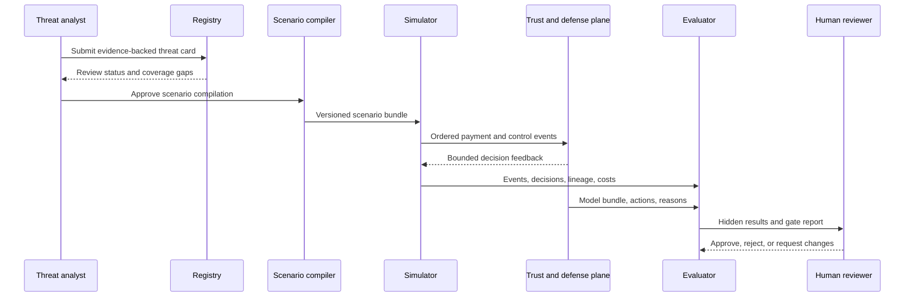
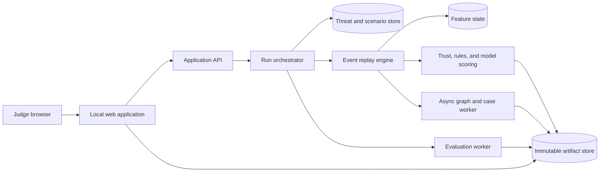

# System architecture

## 1. Architectural style

The competition build shall be a modular monolith with explicit interfaces. This minimizes operational risk while preserving boundaries that can later become services.

Core rule: the generator, defender, evaluator, and governance layers must be replaceable independently. No layer may import another layer’s hidden implementation details.

## 2. Component responsibilities

| Component | Responsibility | Must not do |
|---|---|---|
| Registry | Store threats, evidence, confidence, coverage, and review state | Generate events or score transactions |
| Compiler | Validate and compile threat cards into scenario bundles | Add undocumented assumptions |
| Simulator | Execute rail lifecycle and produce deterministic events | Read defender weights or hidden evaluation gates |
| Red team | Propose bounded campaign changes | Access labels, gradients, future events, or hidden oracle details |
| Trust plane | Verify agentic integrity claims | Convert failed integrity into a probabilistic score |
| Feature state | Maintain past-only transaction and entity state | Read future or offline-only attributes |
| Defense | Produce risk, reasons, and recommended actions | Promote itself |
| Case engine | Group evidence into campaigns and cases | Change original decisions |
| Evaluator | Compute metrics and enforce gates | Modify candidate models or data |
| Governance | Preserve artifacts and human decisions | Silently overwrite prior runs |
| Web app | Orchestrate and explain the workflow | Become the source of evaluation truth |

## 3. End-to-end data flow

## 4. Deployment view

The competition build may use local files or an embedded database. The interface must not depend on that storage choice.

## 5. Synchronous decision path

1. Validate event schema and version.
2. Resolve feature availability and freshness.
3. For agentic commerce, verify integrity and mandate.
4. Evaluate deterministic rules.
5. Fetch or update past-only feature state.
6. Score champion and shadow challenger.
7. Calibrate score and apply action policy.
8. Return reason codes, evidence, freshness, trace, and latency.
9. Append the complete decision artifact immutably.

## 6. Asynchronous path

1. Expand entity graph.
2. Identify campaign candidates.
3. Merge or split investigator cases.
4. Update entity and campaign risk.
5. Reconstruct movement of funds.
6. Monitor drift, calibration, workload, and outcome maturation.
7. Produce offline evaluation and promotion evidence.

## 7. Isolation boundaries

### Generator-defender boundary

- Communicates through versioned events and bounded decision feedback.
- Defender code cannot import simulator internals.
- Scenario fingerprints are forbidden as features.

### Defender-evaluator boundary

- Evaluator accepts a versioned model bundle and immutable result stream.
- Candidate models cannot change gates or metric definitions.

### Development-hidden boundary

- Hidden generator is packaged separately.
- Defender is frozen before hidden evaluation.
- Hidden parameters and constraints are not exposed before the final run.

### Model-policy boundary

- Model produces evidence and calibrated risk.
- Policy maps that evidence to a rail-appropriate recommendation.
- Decision owner is explicit.

## 8. Persistence model

Use immutable artifacts plus small mutable indexes.

### Immutable

- Evidence records.
- Approved threat-card versions.
- Scenario bundles.
- Event streams.
- Model bundles.
- Evaluation configurations.
- Run outputs.
- Promotion reports.

### Mutable indexes

- Latest approved threat-card pointer.
- Current champion pointer.
- Case status.
- Review assignment.
- UI preferences.

Mutating an index must not mutate the artifact it references.

## 9. Failure modes

| Failure | Required behavior |
|---|---|
| Duplicate event | Return the prior result or process idempotently |
| Unsupported schema | Reject with version reason code |
| Required integrity evidence missing | Fail closed for agentic request |
| Optional enrichment missing | Score degraded path and flag output |
| Feature state unavailable | Invoke declared rules-only fallback |
| Model timeout | Use fallback and record timeout |
| Graph worker unavailable | Continue synchronous scoring; queue graph work |
| Evaluator gate failure | Block promotion |
| Artifact write failure | Do not report run complete |
| External model unavailable | Use cached deterministic replay |

## 10. Observability

Required operational metrics:

- Score throughput and latency.
- Error and fallback counts.
- Feature freshness and missingness.
- Score and action distributions.
- Per-rail and per-segment false positives.
- Queue arrivals, backlog, service time, and SLA breaches.
- Model, rule, feature, and scenario versions.
- Drift and calibration.
- Artifact completeness.

## 11. Architecture acceptance tests

- Replace the development simulator without modifying the evaluator.
- Replace logistic validation model with GBDT without modifying simulator code.
- Restart scoring and reproduce predictions from the same model bundle.
- Append future events and verify earlier decisions remain byte-equivalent.
- Disable graph processing and verify synchronous fallback behavior.
- Reject a schema field that is unavailable at decision time.
- Reconstruct any displayed decision from its trace identifier.

