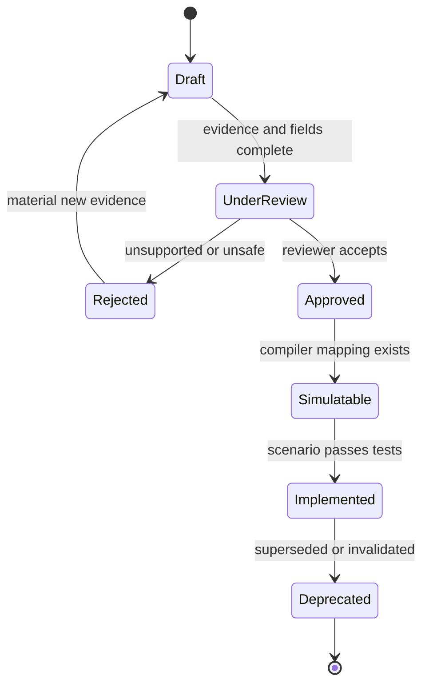

# Threat registry specification

## 1. Purpose

The registry converts unstructured evidence into reviewed, testable hypotheses. It provides breadth for attack identification and a controlled handoff to scenario generation.

It is not an autonomous threat oracle. Human review remains responsible for evidence quality, safety, and interpretation.

## 2. Threat-card lifecycle

## 3. Threat-card schema

### Identity

- `threat_id`
- `title`
- `version`
- `status`
- `created_at`
- `reviewed_at`
- `owners`

### Classification

- Rail: card, A2A, agentic commerce, cross-rail.
- Channels and observation viewpoints.
- Attack family and lifecycle stages.
- Target entities.
- Authorized or unauthorized payment classification.
- Known, emerging, hypothesized, or horizon status.

### GenAI capability delta

- Capability: generation, personalization, translation, synthetic media, planning, automation, adaptation, coordination, semantic manipulation, or agent autonomy.
- Non-GenAI baseline behavior.
- Expected change in cost, speed, scale, success, diversity, or observability.
- Testable payment-side consequences.
- Confidence and uncertainty.

### Evidence

- Evidence record IDs.
- Direct source URLs.
- Source type and publisher.
- Publication and access dates.
- Extracted claim in project wording.
- Source fact versus project inference.
- Quality score and reviewer notes.

### Payment mechanism

- Preconditions.
- Attack stages.
- Payment lifecycle transitions.
- Attacker resources and costs.
- Network-visible signals.
- Partner-enriched signals.
- Offline-only evidence.
- Potential defensive actions and action owners.

### Simulation

- Simulation support status.
- Scenario template.
- Required parameters and constraints.
- Known fidelity limitations.
- Safety classification.
- Hidden validity properties.

## 4. Evidence-quality rubric

| Grade | Definition | Use |
|---|---|---|
| A | Primary standard, official report, direct dataset, peer-reviewed study, or verified incident analysis | Strong factual claim |
| B | Reputable secondary analysis with transparent sourcing | Supporting claim |
| C | Vendor, media, or practitioner report with partial evidence | Hypothesis or context |
| D | Anecdote, unsourced claim, or speculative post | Research lead only |

No threat may be labeled observed solely from Grade D evidence.

## 5. GenAI relevance test

A card passes GenAI relevance only if it answers:

1. What attacker capability changes because of GenAI?
2. What matched non-GenAI baseline exists?
3. What downstream payment behavior changes?
4. What measurable experiment can falsify the claimed capability delta?

If disabling the GenAI component leaves the attack unchanged, the card is classified as conventional fraud assisted by generic automation, not a distinct GenAI-enabled threat.

## 6. Coverage matrix

The registry shall report coverage by:

- Rail.
- Channel.
- Payment lifecycle stage.
- Attack family.
- GenAI capability.
- Decision viewpoint.
- Evidence confidence.
- Simulation support.
- Defender support.

Coverage is not a count alone. The report must expose blind spots such as many card scenarios but no A2A recovery state, or many scam cards but no executable agentic scenario.

## 7. Scenario promotion gate

A threat card can enter the scenario compiler only if:

- Status is approved.
- Rail and observation viewpoint are explicit.
- GenAI capability delta is testable.
- Evidence or hypothesis status is clear.
- Attacker objective and costs are defined.
- Defender knowledge boundary is defined.
- Safety classification permits synthetic execution.
- Required event fields exist in the corresponding rail contract.

## 8. Initial threat portfolio

The first registry should cover at least:

- AI-personalized APP scams.
- Deepfake-assisted executive or family impersonation.
- Multilingual scam scaling.
- AI-generated phishing and account-takeover orchestration.
- Adaptive card testing.
- Low-and-slow CNP abuse.
- Synthetic identity and account farming.
- Mule recruitment and coordinated cash-out.
- Merchant and refund abuse.
- Dispute and friendly-fraud manipulation.
- Agent prompt injection.
- Cart, merchant, beneficiary, amount, and currency substitution.
- Delegated-token overscope.
- Intent and receipt replay.
- Cross-channel social, account, and payment coordination.

## 9. Safety controls

- Store capability-level descriptions, not operational exploitation instructions.
- Reject live identifiers and targetable infrastructure.
- Require reviewer approval before scenario compilation.
- Sanitize exports.
- Record who approved each evidence claim and scenario mapping.

## 10. Acceptance tests

- Reject a card with no GenAI capability delta.
- Reject a card that mixes source fact and inference without labeling.
- Reject a card with no observation viewpoint.
- Reject a card whose required fields are unavailable on its selected rail.
- Generate a coverage report with at least one visible gap.
- Trace every executable scenario to an approved threat-card version and evidence record.

