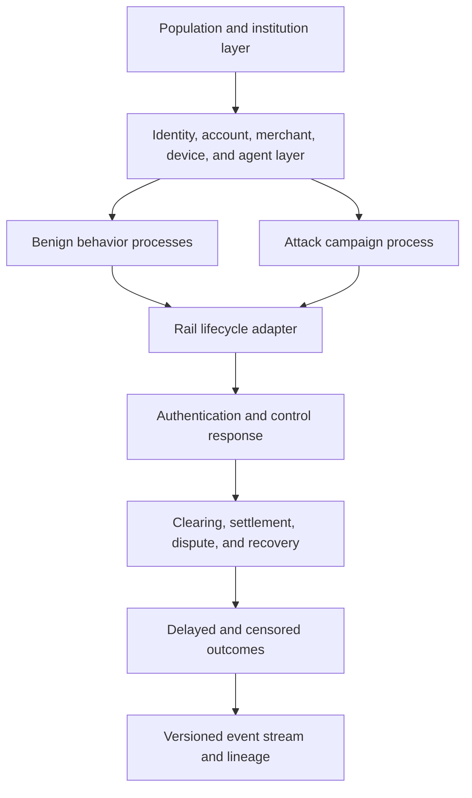
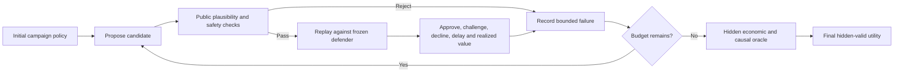

# Simulation and red-team specification

## 1. Simulation objective

Generate deterministic, mechanism-driven payment campaigns that preserve rail semantics, lifecycle causality, value conservation, benign complexity, and attacker economics.

Deep generative models may estimate leaf distributions such as amount, timing, or merchant selection. They must not replace the state machine, entity graph, payment lifecycle, or economic constraints.

## 2. Simulation layers

## 3. Entity model

Required entity types:

- Person or organization.
- Payment account.
- Card or tokenized credential.
- Bank, issuer, acquirer, or receiving institution.
- Merchant and merchant location.
- Beneficiary endpoint.
- Device and session.
- Agent and signing key.
- Mandate, consent, cart, and payment intent.
- Campaign and case.

Identifiers shall be pseudonymous and stable within a run. Relationships shall be explicit rather than inferred from name prefixes.

## 4. Rail adapters

### Card adapter

Models authentication, token/cryptogram state, card-present/CNP, entry mode, 3DS/ECI where configured, issuer authorization, response reason, clearing, settlement, dispute, chargeback, and recovery.

### A2A adapter

Models initiation channel, debtor and creditor accounts, beneficiary age, sending and receiving institution, confirmation or warning, authorization, settlement, scam report, interbank escalation, freezing, recovery, and cash-out.

### Agentic-commerce adapter

Models registered agent, mandate, cart and merchant binding, payment credential scope, consent, nonce, authorization, execution receipt, and revocation.

## 5. Event semantics

Every event shall include four time concepts:

- `event_time`: when the real or simulated activity occurred.
- `ingested_at`: when the platform received it.
- `available_at`: when it became valid for feature or policy use.
- `decision_at`: when a decision was made.

The synchronous defender may use a source only when `available_at <= decision_at`. Equal-time behavior must be explicitly ordered or treated as unavailable.

## 6. Money and state conservation

For every account and currency:

`opening balance + settled inflows + credits - settled outflows - fees - reversals = closing balance`

The simulator shall emit a reconciliation record per account, campaign, institution, and run. Any mismatch blocks the run.

## 7. Attacker economics

The attacker balance sheet shall include configurable:

- Identity or credential acquisition cost.
- Account, merchant, or mule cost.
- Infrastructure and model cost.
- Authentication friction.
- Transaction limit and decline risk.
- Mule commission.
- Settlement delay.
- Recovery and seizure probability.
- Cash-out cost.
- Query and time budget.

The optimization target is expected net realized value, not requested transaction value.

## 8. Adaptive loop

The hidden oracle is applied after the search for final validity and may also enforce hard public safety constraints earlier. Its hidden criteria must not leak through detailed feedback.

## 9. Search controls

All planners receive identical:

- Initial scenario.
- Search dimensions.
- Environment seeds.
- Frozen defender.
- Decision feedback.
- Query and wall-clock budgets.
- Economic and safety constraints.

Candidate comparisons shall use common random numbers or repeated frozen backgrounds. Attack parameters must not be confounded with different benign histories.

## 10. Deep generation policy

Permitted uses:

- Conditional amount, time, category, text, and entity-attribute generation.
- Personalized but synthetic scam content used to derive a victim-response probability.
- Diverse scenario narratives for analyst review.

Not sufficient on its own:

- Independent row generation without temporal or entity state.
- A text description labeled as a simulated campaign.
- LLM selection from a fixed candidate list with no behavioral feedback.

## 11. Benign stress suites

- Shared household and enterprise devices.
- Legitimate shared beneficiaries.
- Travel and relocation.
- Payroll, bill payment, and seasonality.
- New merchant and new account cold starts.
- Retry and duplicate behavior.
- Merchant promotions and volume spikes.
- Missing device, beneficiary, or authentication fields.
- Late and corrected responses.
- Foreign exchange and currency changes.

## 12. Deterministic replay

Every run artifact shall include:

- Scenario bundle hash.
- Source-code and dependency hashes.
- Random seeds and random-stream assignments.
- Model IDs, prompt templates, prompts, and responses.
- Candidate sequence and feedback.
- Event stream.
- Decision stream.
- Reconciliation output.
- Evaluation configuration.

## 13. Acceptance tests

- Same bundle and seed produce the same event and lineage hashes.
- Downstream cash-out fails if upstream settlement is removed.
- Fraud and benign behavior share some novelty signals.
- Late, duplicate, and out-of-order events follow declared semantics.
- Adaptive candidate `n+1` changes when prior feedback changes.
- Random and adaptive planners use identical frozen backgrounds.
- Hidden-valid adaptive performance is compared with matched random search.
- Simulator fingerprints are not available to the defender.

