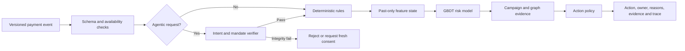
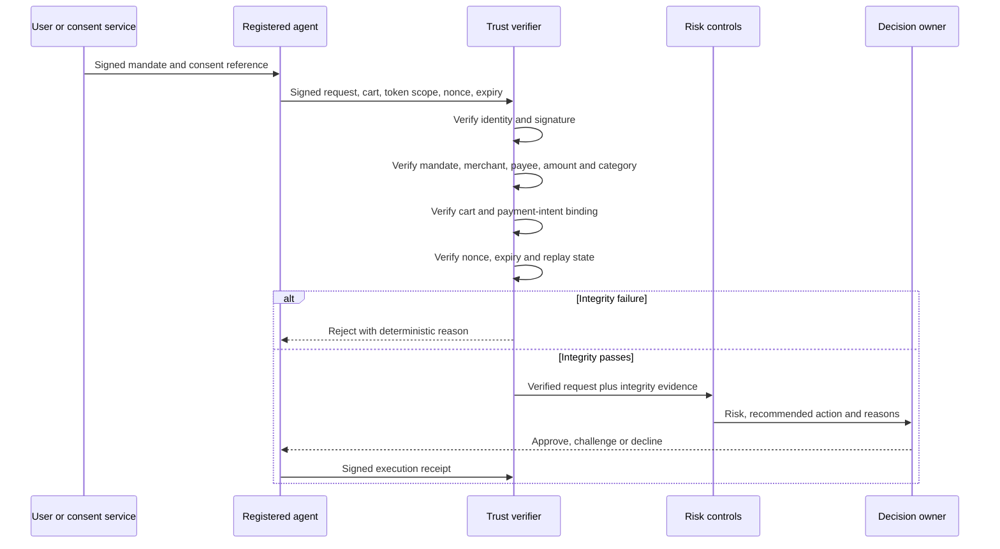

# Defense and agentic trust specification

## 1. Defense principle

Payment assurance requires layered controls. Cryptographic or semantic integrity, transaction risk, campaign detection, operational action, and investigation are distinct responsibilities.

## 2. Layered control flow

## 3. Rules baseline

The rules engine shall cover transparent, rail-appropriate controls such as:

- Velocity and retry limits.
- Amount and merchant consistency.
- New device, new beneficiary, and new credential policies.
- Authentication and cryptogram failures.
- Beneficiary age and fan-in where available.
- Mandate, token, nonce, cart, and merchant integrity.
- Campaign entity and shared-infrastructure thresholds.

Rules shall be versioned and evaluated as a serious baseline, not deliberately weakened.

## 4. GBDT baseline and champion

The default model shall use a production-style CatBoost or LightGBM pipeline with:

- Raw transaction and payment fields.
- Account, merchant, beneficiary, device, institution, and agent profiles.
- Strictly past-only velocity features.
- Entity-sharing and motif features.
- Segment and rail context.
- Missingness and freshness indicators.

Preprocessing shall be serialized with the model and applied identically during training and inference.

## 5. Graph and campaign challenger

Campaign analytics may use:

- Fan-in, fan-out, reuse, overlap, and path features.
- Temporal motifs.
- Connected components or community candidates.
- Flow reconstruction.
- Campaign-level aggregation.
- Optional temporal GNN embeddings.

Any GNN must beat graph-feature GBDT on a predeclared value or workload metric to earn inclusion.

## 6. Agentic verification sequence

## 7. Action policy

Model score alone shall not equal a decline decision. The policy combines:

- Integrity status.
- Calibrated fraud probability.
- Expected fraud value.
- False-decline or abandonment cost.
- Authentication and review cost.
- Rail and decision-owner permissions.
- Current queue and challenge capacity.
- Campaign evidence.

Actions shall be evaluated separately. A threshold suitable for analyst review is not automatically suitable for decline.

## 8. Case construction

The case engine shall:

- Link related transactions and entities.
- Deduplicate alerts.
- Preserve evidence and chronology.
- Record campaign value before and after first alert.
- Estimate analyst effort.
- Support disposition and delayed labels.
- Feed matured outcomes into later training windows without crossing time boundaries.

## 9. Explanation contract

Reason codes must be:

- Stable across equivalent inputs.
- Linked to decision-available evidence.
- Rail-appropriate.
- Actionable by the decision owner or investigator.
- Free of simulator IDs and hidden labels.
- Tested for segment stability.

Examples:

- `MANDATE_EXPIRED`
- `CART_HASH_MISMATCH`
- `BENEFICIARY_RECENTLY_ADDED`
- `DEVICE_SHARED_ACROSS_ACCOUNTS`
- `CAMPAIGN_FAN_IN_INCREASE`
- `DECLINE_RETRY_BURST`
- `FEATURE_STATE_DEGRADED`

## 10. Calibration and drift

- Use a past-only calibration window.
- Report Brier score and expected calibration error.
- Evaluate calibration by rail and material segment.
- Monitor score, feature, action, workload, and outcome drift.
- Block automatic threshold changes in the competition prototype.

## 11. Model bundle

The bundle shall contain:

- Model and preprocessing artifacts.
- Feature-contract versions.
- Training cutoff and label-maturity rule.
- Calibration artifact.
- Decision-policy version.
- Reason-code mapping.
- Environment lock and hashes.
- Model and data cards.
- Rollback pointer.

## 12. Acceptance tests

- Training and inference transformations produce identical logits for the same matrix.
- Appending future events does not change prior features, scores, cases, or actions.
- Same-timestamp events do not observe one another unless ordered explicitly.
- Agentic integrity failures cannot be overridden by model risk.
- Replayed nonce, substituted merchant, altered cart, overscope, and expiry are rejected.
- Rules and GBDT are evaluated at identical action budgets.
- Campaign grouping reduces transaction alerts into cases without losing evidence.
- Missing enrichment invokes the declared degraded path.
- Restarted serving reproduces prior scores from the model bundle.

