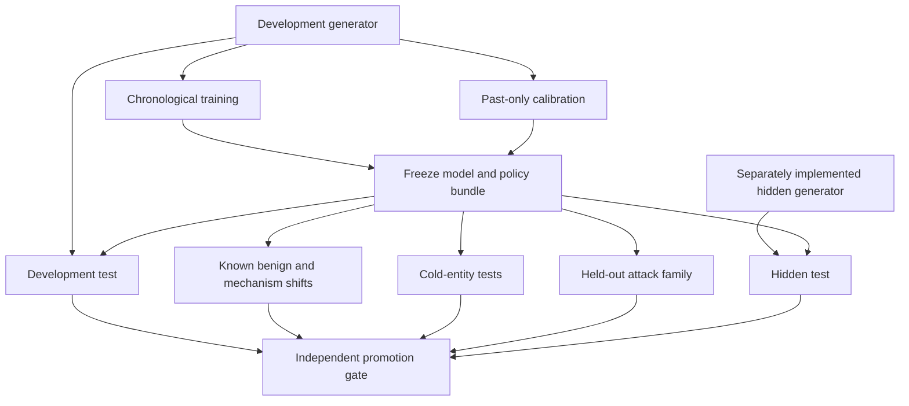

# Evaluation and validation plan

## 1. Evaluation doctrine

The purpose of the range is falsification, not metric maximization. A result is credible only when the comparison is fair, decisions are past-only, operating budgets are fixed, hidden evaluation is separated, and failed hypotheses remain visible.

## 2. Evaluation topology

## 3. Experimental units

Report uncertainty across campaigns and environment regimes, not only random event seeds. Recommended units:

- Campaign.
- Institution or simulated portfolio.
- Time block.
- Environment regime.
- Independent generator.

Five seeds from one generator estimate only sampling variability inside that generator.

## 4. Dataset splits

### Chronological development

- Training ends before calibration.
- Calibration ends before development test.
- Labels are included only when mature by the relevant cutoff.
- Campaigns do not cross partitions.

### Entity slices

- Returning accounts and merchants.
- Cold account.
- Cold device.
- Cold merchant.
- Cold beneficiary.
- Cold institution where feasible.

### Robustness slices

- Benign novelty.
- Prevalence dilution.
- Missing enrichment.
- Late and out-of-order data.
- Authentication-policy change.
- Cross-border and currency shift.
- Unseen attack family.
- Separately implemented hidden generator.

## 5. Model comparisons

Required comparisons:

1. Transaction-only baseline.
2. Tuned deterministic rules.
3. Transaction/entity GBDT.
4. Temporal-feature GBDT.
5. Graph-feature GBDT.
6. Optional temporal or graph neural model.
7. Layered champion policy.

All models receive only fields available to their declared viewpoint and decision time.

## 6. Adaptive-attacker comparisons

| Planner | Learns from feedback? | Purpose |
|---|---:|---|
| Fixed scenario | No | Human-authored reference |
| Random search | No | Query-budget control |
| Adaptive optimizer | Yes | Non-LLM adaptation control |
| LLM or agent planner | Yes | GenAI orchestration test |

All use the same frozen environments, defender, feedback, query budget, wall-clock budget, and public validity checks.

Primary red-team outcomes:

- Hidden-valid net value.
- Valid evasion discovery rate.
- Queries to first valid evasion.
- Transfer to unseen defender or hidden generator.
- Campaign diversity under semantic constraints.
- Invalid and safety-rejected proposal rate.

## 7. Metrics

### Detection and prevention

- Preventable authorized and settled fraud value.
- Event recall at fixed false-positive rate.
- Campaign recall at fixed action budget.
- Time to first alert.
- Value moved before first alert.
- Remaining preventable value.
- Entity and flow reconstruction quality.

### Customer and operations

- False declines per 10,000 legitimate transactions.
- Challenges per 10,000.
- Review cases per 100,000.
- Transactions and entities per case.
- Estimated analyst minutes.
- Backlog and SLA breaches.
- Value captured per analyst-hour.

### Statistical and model quality

- Average precision and ROC AUC as diagnostic metrics.
- Brier score and expected calibration error.
- Per-family and per-segment performance.
- Bootstrap or hierarchical uncertainty intervals.
- Reason-code stability.
- Feature and score drift.

### Engineering

- p50, p95, and p99 latency.
- Sustained events per second.
- Memory growth.
- Duplicate and late-event behavior.
- Recovery and replay equivalence.

## 8. Operating-point policy

No model is compared at an arbitrary self-selected threshold. Compare at the same:

- False-decline budget.
- Challenge budget.
- Review capacity.
- Latency objective.
- Action permissions.

Thresholds are learned or calibrated using past-only data and remain frozen during each test regime.

## 9. Online triage evaluation

Review capacity is allocated per time bucket, not across the future-complete batch.

Required queue simulation:

- Event or case arrival time.
- Priority calculated from prior information only.
- Analyst service time.
- Capacity by hour or day.
- Backlog.
- SLA.
- Disposition and label maturation.

Appending future events must not change an earlier queue priority or decision.

## 10. Integrity and leakage suite

### Temporal

- Append future events for the same account, device, merchant, beneficiary, and agent.
- Add equal-time events in different input orders.
- Insert late responses and corrected timestamps.
- Cross batch and day boundaries.
- Verify previous outputs are byte-equivalent.

### Semantic leakage

- Attempt to inject label, campaign, scenario, generator, and post-decision fields.
- Mutate allowed features to contain forbidden semantics.
- Run an independent provenance audit using source event IDs.

### Train-serving parity

- Compare training transformations with serving transformations.
- Replay the training matrix through the serialized model bundle.
- Verify logits and probabilities to tolerance.

### Generator fingerprint

- Train a detector to distinguish simulator branches using permitted features.
- Review high-importance features for scenario artifacts.
- Evaluate defender on a separately authored generator.

## 11. Metamorphic tests

- Row permutation preserves results after stable ordering.
- Duplicate event ID does not double-count.
- Renaming synthetic IDs preserves invariant features and results.
- Currency conversion with consistent scaling preserves equivalent economic behavior.
- Removing an upstream settlement invalidates dependent cash-out.
- Adding future events does not affect past outputs.
- Restart and checkpoint replay reproduce outputs.
- Missing optional enrichment activates the expected degraded path.

## 12. Promotion gates

### Automatic blockers

- Temporal, label, scenario, or generator leakage.
- Hidden-generator import or data access by defender.
- Payment conservation failure.
- Critical agentic integrity failure.
- Breach of safety boundary.
- Missing model, data, threat, or evaluation lineage.
- Operational budget breach beyond the declared margin.

### Performance gates

- Improvement over rules and strongest GBDT on a primary value or workload metric.
- No strategically important family below its declared minimum.
- Acceptable calibration and reason-code stability.
- Hidden transfer above the declared minimum.
- No material segment regression without documented human acceptance.

## 13. Reporting rules

- Report failures next to successes.
- Report sample counts and prevalence.
- Report family-level results before pooled summaries.
- Avoid excessive decimal precision.
- Separate preregistered tests from exploratory results.
- Label same-code shift tests accurately.
- Never call a fixed or random search adaptive.
- Keep the original hypotheses immutable; add new hypotheses for revised operational gates.

## 14. Current validation-spike interpretation

The existing spike supports the feasibility of past-only temporal and graph features, hidden shift testing, and bounded candidate evaluation. It does not yet validate a strong defender, adaptive optimizer, independent generator, online queue, payment lifecycle, or agentic trust plane.

It remains an appendix and regression seed for the proposed platform.

