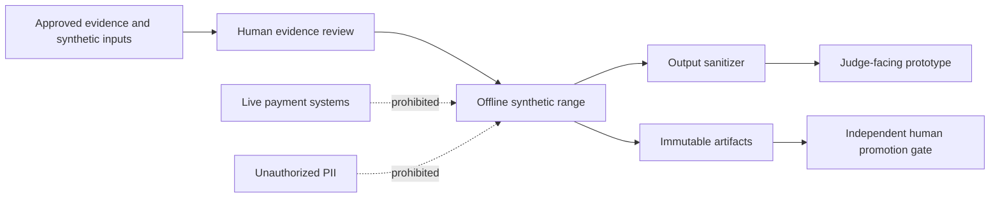

# Security and governance specification

## 1. Security objective

Enable useful adversarial assurance without creating a live fraud tool, exposing unauthorized data, or allowing a candidate model to approve itself.

## 2. Trust boundaries

## 3. Data rules

- Synthetic, anonymized, or explicitly authorized sample data only.
- No live credentials, account numbers, personal contact details, or targetable infrastructure.
- Field-level purpose and retention classification.
- Pseudonymous identifiers in all demos and exports.
- No raw entity histories exported from the prototype by default.
- Submission archive built from an explicit allowlist.

## 4. Attack-content controls

- Threat cards store capabilities and payment mechanisms, not operational exploitation steps.
- Scenario compilation requires approval.
- The adaptive planner targets only local synthetic interfaces.
- External network tools and live payment endpoints are unavailable.
- Prompts and outputs are logged and sanitized.
- Exported reports omit sensitive parameter combinations when they could enable misuse.

## 5. Role separation

| Role | Allowed | Prohibited |
|---|---|---|
| Threat analyst | Add evidence and draft cards | Approve own high-risk scenario alone |
| Scenario reviewer | Approve synthetic scenario | Modify hidden evaluation after results |
| Defender developer | Train and package model | Access hidden generator or labels |
| Evaluator | Run metrics and gates | Modify candidate model |
| Promotion reviewer | Approve or reject | Auto-delegate decision to candidate model |
| Demo user | Run approved scenarios | Export live-target attack recipes |

Competition roles may be held by the same person at different times, but artifacts and approval steps must remain logically separated and auditable.

## 6. Immutable lineage

Each run directory shall be content-addressed and contain:

- Parent run and source revision.
- Environment lock and dependency hashes.
- Evidence and threat-card versions.
- Scenario and hidden-profile references.
- Seeds and external model identifiers.
- Prompts, tool calls, and cached outputs.
- Event, decision, and evaluation artifacts.
- Safety, leakage, and reconciliation results.
- Human decisions.

No run is overwritten. A pointer such as `latest` may change, but the artifact it references may not.

## 7. Model governance

- Champion and challenger are explicit.
- Shadow evaluation cannot change the production recommendation in the prototype.
- Promotion gates are versioned independently from models.
- Model bundle includes data cutoff, feature contract, calibration, policy, reason codes, and rollback.
- Every promotion and rejection records the reviewer and rationale.
- Emergency rollback is tested.

## 8. Software supply chain

Before submission:

- Isolate the challenge repository.
- Pin direct and transitive dependencies with hashes where feasible.
- Confirm OSI-approved licenses and competition compatibility.
- Generate an SBOM.
- Run secret and credential scans.
- Inspect the archive contents manually.
- Remove absolute user paths and private metadata.
- Include source and license notices.

## 9. Threat model

### Assets

- Threat evidence.
- Scenario definitions.
- Hidden evaluation constraints.
- Model bundles.
- Artifact lineage.
- Promotion decisions.
- Synthetic entity and event data.

### Threats

- Hidden-generator leakage.
- Label or future-information leakage.
- Prompt injection into the scenario authoring workflow.
- Artifact tampering or overwrite.
- Unauthorized scenario export.
- Secret leakage through repository packaging.
- Dependency compromise.
- Model or evaluator self-approval.
- Unsafe external tool invocation.

### Controls

- Typed contracts and allowlists.
- Network-isolated synthetic execution.
- Immutable hashes and audit chain.
- Role-separated approvals.
- Output sanitizer.
- CI integrity tests.
- Dependency and secret scanning.
- Human promotion gate.

## 10. Privacy and fairness

- Do not claim demographic fairness when synthetic attributes cannot validate it.
- Evaluate customer-harm disparities across modeled geography, merchant, account-age, channel, and data-availability segments.
- Record missingness and enrichment availability as potential sources of unequal friction.
- Prohibit protected attributes unless an approved fairness evaluation requires them.
- State all synthetic-demographic limitations.

## 11. Audit events

Audit log shall cover:

- Evidence create, edit, review, and approval.
- Scenario compile and rejection.
- Red-team run and safety rejection.
- Model train, package, score, and compare.
- Hidden evaluation start and result release.
- Promotion, rejection, and rollback.
- Report and scenario export.

## 12. Governance acceptance tests

- Attempt to target a non-local endpoint and verify denial.
- Attempt to store a live-like account identifier and verify validation or sanitization.
- Attempt to overwrite an existing run and verify refusal.
- Attempt to promote without hidden evaluation and verify blocking.
- Attempt to let candidate code modify gates and verify isolation.
- Build an allowlisted archive and verify no unrelated repository files appear.
- Run dependency-license, SBOM, secret, and metadata checks.

