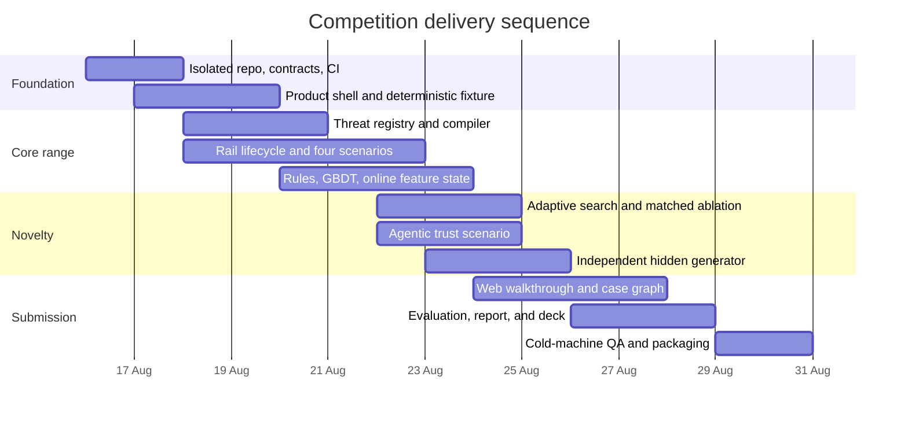

# Delivery roadmap

## 1. Delivery strategy

Build a competition-grade vertical slice, not a production platform. Preserve the validation spike as an appendix and implement only the components necessary to make the full assurance loop credible.

## 2. Critical path

The dates are an aggressive competition schedule. Parallel ownership is assumed.

## 3. Milestones

### M0: Scope freeze and repository safety

Deliverables:

- Isolated project repository.
- Requirements and architecture approved.
- Team roles and competition registration checked.
- Submission allowlist and secret scan configured.

Exit criteria:

- No unrelated parent-repository files can enter the archive.
- Four executable scenarios and one golden path are frozen.

### M1: Contracts and deterministic skeleton

Deliverables:

- Typed common envelope and rail contracts.
- Scenario, scoring, and evaluation contracts.
- Modular application skeleton.
- Deterministic fixture and immutable run directory.

Exit criteria:

- One synthetic card or A2A event runs end to end.
- Restart reproduces the result.

### M2: Identify and Generate

Deliverables:

- At least 20 threat cards.
- Scenario compiler.
- Four scenario families.
- Payment lifecycle and reconciliation.
- Benign novelty suites.

Exit criteria:

- Each scenario traces to evidence and passes conservation tests.
- Coverage report identifies remaining blind spots.

### M3: Defend

Deliverables:

- Tuned rules.
- GBDT model and serialized preprocessing.
- Past-only feature state.
- Action policy, reason codes, and case grouping.

Exit criteria:

- Rules and GBDT compare at equal operating budgets.
- Future append and train-serving parity tests pass.

### M4: Novelty and hidden assurance

Deliverables:

- Fixed, random, adaptive, and agent planner interfaces.
- Matched-budget ablation.
- Hidden validity oracle.
- Separately implemented hidden generator.
- Agentic trust verifier and attack suite.

Exit criteria:

- Candidate `n+1` depends on prior feedback.
- Hidden evaluation occurs after model freeze.
- Agentic replay and substitution attacks fail deterministically.

### M5: Prototype and submission

Deliverables:

- Six-view web prototype.
- Five-minute demo.
- Walkthrough document.
- Model, data, threat, and evaluation cards.
- License, SBOM, archive and cold-start evidence.

Exit criteria:

- A new reviewer completes the demo unaided.
- Clean-machine start and network-offline tests pass.

## 4. Parallel workstreams

| Workstream | Primary output | Dependencies |
|---|---|---|
| Product and UI | Golden-path prototype and walkthrough | Contracts and deterministic fixture |
| Threat and simulation | Registry, compiler, scenarios, hidden generator | Rail contracts |
| Defense and evaluation | Rules, GBDT, feature state, metrics | Event stream and labels |
| Agentic trust | Verifier and attack suite | Agentic contract |
| Governance and submission | Artifacts, licenses, report, archive | All workstreams |

## 5. Daily integration gates

- Main branch starts from a clean environment.
- Deterministic fixture hash is stable unless deliberately versioned.
- Tests fail on integrity or conservation violations.
- No future-information regression.
- UI golden path remains usable.
- Documentation status matches implementation status.
- Submission archive dry run contains only allowlisted files.

## 6. Scope-cut order

If time slips, cut in this order:

1. Temporal GNN.
2. Cloud deployment.
3. More than four deep scenarios.
4. Advanced LLM multi-agent orchestration.
5. Full investigator workflow beyond one case.
6. Rich streaming partition and watermark implementation.

Do not cut:

- Complete Identify, Generate, and Defend flow.
- Strong baselines.
- Past-only evaluation.
- Payment conservation.
- Hidden generator separation.
- Agentic integrity proof.
- Web prototype and walkthrough.
- Safety and packaging checks.

## 7. Go/no-go checkpoints

### Seven days before submission

No-go if the end-to-end golden path is not running. Freeze new research and finish integration.

### Three days before submission

No-go for any scenario or model that does not have complete lineage, tests, and deterministic replay. Remove it from the demo.

### One day before submission

No code or model changes except fixes for a reproduced blocker. Rebuild, scan, extract, start, rehearse, and archive.

## 8. Definition of done

Done means the acceptance criteria in [SOLUTION_SPEC.md](../SOLUTION_SPEC.md), [Product requirements](01-product-requirements.md), [Evaluation and validation](07-evaluation-and-validation.md), and [Prototype, demo, and submission](09-prototype-demo-and-submission.md) are evidenced in [TRACEABILITY.md](TRACEABILITY.md).

