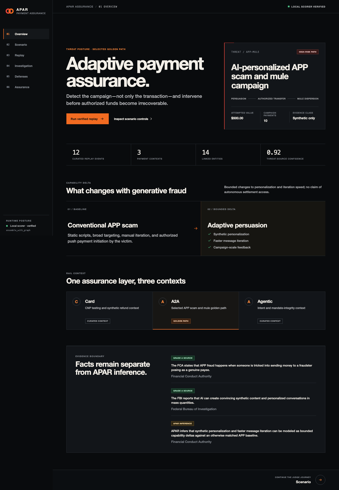

<p align="center"><code>APAR / MASTERCARD INNOVATION CHALLENGE 2026</code></p>

# Adaptive Payment Assurance Range

<p align="center"><strong>Assure the campaign. Verify the intent. Promote only the evidence.</strong></p>



> [!IMPORTANT]
> APAR is a synthetic, pre-production assurance prototype. The accepted
> competition model is the Stage 30 `ensemble_with_graph` bundle; the official
> evaluation chain remains incomplete at Stage 70.

## Judge route

| Step | Open | What it proves |
|---:|---|---|
| 01 | [Pitch deck (PDF)](APAR_COMPETITION_DECK.pdf) or [editable deck](APAR_COMPETITION_DECK.pptx) | The problem, system, evidence, and claim boundary in 11 slides |
| 02 | [Five-minute walkthrough](FIVE_MINUTE_WALKTHROUGH.md) | A recording-ready route through the working console |
| 03 | [Competition traceability](COMPETITION_TRACEABILITY.md) | Challenge requirement → APAR response → demonstrable proof |
| 04 | [Model card](MODEL_CARD.md) and [data card](DATA_AND_SIMULATION_CARD.md) | Model identity, synthetic scope, and safe-use boundary |
| 05 | [Evaluation and limitations](EVALUATION_AND_LIMITATIONS.md) | Recovered diagnostics, rejected arms, and incomplete official stages |
| 06 | [Research journey](RESEARCH_AND_EXPERIMENT_JOURNEY.md) | Why failure gates, graph context, and deterministic intent checks shaped the design |
| 07 | [Commercial and deployment plan](COMMERCIAL_AND_DEPLOYMENT_PLAN.md) | A governed path from offline replay to controlled challenger use |
| 08 | [Release checklist](RELEASE_CHECKLIST.md) | Clean-machine startup, exact replay, and release verification |

## One-command demo

```bash
.venv/bin/python scripts/run_apar_console.py start
```

Open `http://127.0.0.1:4173/overview`. The console calls the local portable
model and transparently switches to a hash-bound verified fallback if the model
worker is unavailable.

## Evidence at a glance

| Evidence class | Judge-facing interpretation |
|---|---|
| Accepted Stage 30 portable bundle | The model and thresholds load and replay exactly |
| Curated 12-scenario replay | Deterministic demonstration, not a population estimate |
| Recovered four-arm metrics | Verified diagnostics, explicitly non-authoritative |
| TrustVerifier tests | Deterministic authorization-integrity enforcement |
| Official Stage 70 | Incomplete; no official capacity or readiness claim |

## Claim boundary

APAR uses no real cardholder data and makes no production-deployment or
external-validation claim. Four-arm recovered metrics remain verified
diagnostics but non-authoritative. The 12-scenario replay is curated. The full
Sentinel hybrid is not the champion, and no model can promote itself.

For third-party package and license inventory, see
[submission notices](THIRD_PARTY_NOTICES.md).
