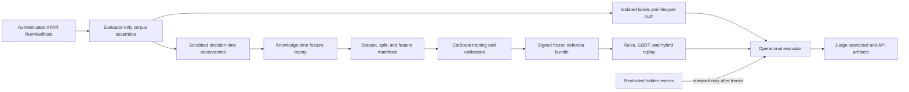

# APAR Competition-Grade Defend Pipeline Design

**Status:** Written spec approved in chat on 2026-08-18; implementation planning authorized

**Branch:** `codex/apar-defend`

**Base:** `codex/apar-foundation` at `4b4ec7b`

**Scope:** Synthetic-data defense, replay evaluation, frozen artifacts, and judge-facing outputs

## 1. Purpose

This subsystem makes the Defend pillar of the Adaptive Payment Assurance Range
(APAR) credible for the Mastercard Innovation Challenge 2026. It adds a strong
gradient-boosted decision-tree baseline, strictly causal features, matched
champion/challenger evaluation, operational metrics, immutable evidence, and
integration with authenticated APAR run artifacts.

The subsystem is an assurance implementation, not a production payment decision
engine. Every dataset remains synthetic. Results establish only internal validity
under the declared generators, regimes, assumptions, and operating budgets. They
must not be presented as evidence of performance on Mastercard, issuer, merchant,
bank, cardholder, or other real-world payment data.

## 2. Repository Constraints and Evidence Preservation

The implementation starts from the clean `codex/apar-foundation` tip at
`4b4ec7b`. Existing Task 6 evidence binds several implementation files byte for
byte. The Defend work must not modify any of these frozen paths:

- `src/apar/generators/__init__.py`
- `src/apar/generators/campaigns.py`
- `src/apar/generators/population.py`
- `src/apar/redteam/benchmark.py`
- `src/apar/redteam/llm_policy.py`
- `src/apar/redteam/policies.py`
- `src/apar/redteam/search.py`
- `src/apar/redteam/task6_experiment.py`
- `src/apar/simulator/engine.py`
- `src/apar/simulator/ledger.py`
- `src/apar/simulator/rails/a2a.py`
- `src/apar/simulator/rails/agentic.py`
- `src/apar/simulator/rails/card.py`
- `src/apar/trust/verifier.py`
- `scripts/run_task6_holdout.py`
- `docs/experiments/task6-*.json`
- all files under `validation_spike/`

New defense packages consume the public contracts and authenticated artifacts
produced by these components. Task 6 evidence and the validation spike remain
historical evidence, not training inputs to be rewritten or reinterpreted.

## 3. Scope

### 3.1 Included

- An artifact-native synthetic corpus assembled from verified APAR runs.
- A separate evaluator-only label and lifecycle view.
- Strict past-only transaction, temporal, entity, graph, and data-quality
  features.
- A serious family-agnostic deterministic rule baseline.
- A CPU CatBoost fraud-risk baseline with chronological model selection and
  calibration.
- Rules-only, GBDT-only, and layered-hybrid defense arms.
- Chronological, cold-entity, leave-one-family-out, declared-regime, and
  independently generated hidden evaluation.
- Detection, calibration, friction, workload, value, alert-time, and latency
  metrics.
- Content-addressed and signed corpus, split, feature, model, threshold,
  prediction, and report artifacts.
- A deterministic verification command and API-ready judge scorecard.

### 3.2 Excluded

- Private, live, scraped, purchased, or unauthorized payment data.
- Automatic production deployment or automatic champion promotion.
- External-validity or real-world fraud-performance claims.
- A graph database, streaming platform, remote feature store, GPU service, or
  distributed training cluster.
- Neural networks, graph neural networks, online learning, and automated
  threshold changes.
- Changes to the existing attack-search behavior or frozen simulator evidence.
- A web UI in this subsystem. Outputs will be designed for later UI consumption.

## 4. Architectural Decision

Use an artifact-native modular-monolith pipeline. The defense packages are
replaceable and communicate through immutable Pydantic contracts and artifact
references.



The simulator never reads model weights, features, thresholds, or evaluation
gates. The feature builder never reads labels or hidden parameters. The model
never reads campaigns, families, scenarios, regimes, roles, seeds, or generator
metadata. The evaluator never mutates a defender artifact.

## 5. Package Boundaries

The implementation plan may refine individual filenames, but it must preserve
these ownership boundaries:

```text
src/apar/defense/contracts.py       Observation and decision-policy contracts
src/apar/evaluation/contracts.py    Evaluator-only corpus, truth, split, and metric contracts
src/apar/evaluation/corpus.py       Verified run ingestion and evaluator-only labels
src/apar/features/catalog.py        Feature availability and forbidden-source policy
src/apar/features/state.py          Knowledge-time causal state and checkpoints
src/apar/features/builders.py       Transaction, temporal, entity, graph, and quality features
src/apar/features/parity.py         Offline/serving parity and provenance audits
src/apar/defense/rules.py           Family-agnostic deterministic rules
src/apar/defense/gbdt.py            CatBoost training, serialization, and scoring
src/apar/defense/calibration.py     Chronological probability calibration
src/apar/defense/policy.py          Matched-budget action selection and fallback
src/apar/defense/bundle.py          Frozen signed defender publication and loading
src/apar/evaluation/splits.py       Campaign-isolated time, entity, family, and regime splits
src/apar/evaluation/regimes.py      Declared lineage-preserving synthetic transformations
src/apar/evaluation/metrics.py      Detection, calibration, operations, value, and time metrics
src/apar/evaluation/replay.py       Three-arm decision replay
src/apar/evaluation/reporting.py    Scorecards, model/data cards, CSV, and Markdown
src/apar/evaluation_hidden/defense_authority.py Frozen-only restricted-event release
src/apar/api/routes/defense.py      Read-only evaluation and scorecard endpoints
scripts/build_defense_corpus.py     Frozen competition-corpus builder
scripts/train_defender.py           Frozen defender training command
scripts/evaluate_defender.py        Development and hidden evaluation command
scripts/verify_g3.py                One-command Defend verification gate
```

Feature code depends only on public event/observation contracts. Model code
depends only on ordered feature matrices and manifests. Hidden-evaluation modules
remain evaluator dependencies and are prohibited imports in `apar.features` and
`apar.defense`.

## 6. Artifact-Native Corpus

### 6.1 Corpus source

The competition corpus is assembled from a preregistered ledger of authenticated
`RunManifest` references. Each run is reverified before its artifacts are read.
The corpus builder rejects:

- an invalid manifest or receipt signature;
- a digest, media type, or lineage mismatch;
- a non-synthetic privacy classification;
- duplicate event or payment identities within the declared corpus;
- an undeclared scenario, family, seed, policy, or regime;
- a run whose declared rail does not match its family;
- an event stream that violates its existing contract.

The default competition profile contains at least 50 campaigns from each of the
four executable families. Its exact seed ledger, scenario references, policy
kinds, simulation times, and run-manifest digests are frozen before model
training. Sample counts and prevalence are reported rather than normalized away.

### 6.2 Decision rows

The corpus contains one risk decision row per payment opening:

- card: `AUTHORIZATION` or `AUTHORIZATION_DECLINED`;
- A2A: `TRANSFER_INITIATED`;
- agentic commerce: `AUTHORIZATION`, `AUTHENTICATION_CHALLENGE`, or
  `AUTHORIZATION_DECLINED` from the verified request outcome.

Later clearing, settlement, return, refund, dispute, chargeback, fraud-report,
freeze, and recovery events remain lifecycle sources for label maturation and
value metrics. They are not duplicated as new fraud-decision rows.

### 6.3 Observation and truth separation

Corpus assembly produces two separately addressed artifacts.

`ObservationDataset` contains only fields allowed at the declared decision time.
It includes current request fields and public identifiers used solely as state
keys. It does not contain target labels or evaluation grouping fields.

`EvaluationTruth` is evaluator-only and contains:

- event and payment identity;
- binary synthetic fraud truth and declared truth source;
- campaign and family membership;
- development or hidden generator provenance;
- label maturity time;
- settlement, recovery, refund, return, and chargeback outcomes;
- entity-cohort and regime labels used only for slicing;
- economic value components needed for metric reconstruction.

The feature pipeline receives only `ObservationDataset`. Dataset construction
tests prove that removing `EvaluationTruth` leaves feature bytes unchanged.

### 6.4 Label maturity

A row may enter model training only if its synthetic label is mature by the
training cutoff. Maturity is the later of the declared label-delay rule and the
first conclusive evaluator lifecycle outcome. Rows without a mature label remain
valid scoring/evaluation observations but cannot enter a training target.

## 7. Forbidden Semantics and Availability

The feature catalog is an allowlist. Every feature declares its owner, rails,
source event kinds, state key, window, aggregation, availability rule, missing
behavior, freshness rule, privacy purpose, and forbidden sources.

At minimum, the following semantics are prohibited from model inputs:

- fraud, illicit, target, label, disposition, chargeback truth, or outcome truth;
- campaign, family, threat, scenario, regime, seed, generator, hidden, or policy
  identity;
- actor or counterparty role labels;
- simulator branches, population illicit flags, attack parameters, or objective;
- post-decision lifecycle state not already available before the decision;
- `viewpoint` when it distinguishes development and hidden generators;
- raw entity IDs as numeric or categorical model columns.

Identifiers may be used only as state keys and provenance references. An
independent semantic audit examines both names and declared source paths so that
renaming a forbidden field does not make it permissible.

## 8. Knowledge-Time Feature Semantics

### 8.1 Causal ordering

Feature state is driven by when information became available, not by event-time
sorting alone.

For a decision at time `T`:

1. Admit historical sources only if `source.available_at < T`.
2. Compute all decisions whose decision time is `T` against the same state.
3. Emit their vectors in stable event-ID order.
4. Observe the same-time sources only after the complete batch is emitted.

The current request may contribute declared raw request fields even when its own
availability time equals the decision time. It cannot contribute to historical
aggregates for itself or another decision at the same time.

Late and out-of-order source events do not alter an already emitted vector. An
offline rebuild places them according to their recorded availability time and
must reproduce the original decision view. If an online checkpoint has advanced
past a late event's availability boundary, the event is marked late and affects
only future state; prior decisions remain immutable.

### 8.2 Feature provenance

Every vector contains:

- event and decision identity;
- feature-catalog version and ordered feature names;
- decision time;
- maximum historical source availability time, or an explicit no-history value;
- source event IDs used by historical features;
- values, missingness flags, and degraded-state status.

Every non-null historical source timestamp must be strictly earlier than the
decision time. Feature-state checkpoints contain a schema version, catalog
digest, watermark, and canonical state digest.

### 8.3 Initial feature families

Transaction features:

- log amount and declared currency support;
- rail and opening-event category;
- UTC hour and day cyclic encodings;
- current integrity-pass indicator where applicable after mandatory verification;
- declared optional-field availability and current request freshness.

Temporal and entity features:

- actor and counterparty event counts over 1 minute, 10 minutes, 1 hour, and
  24 hours;
- actor and counterparty amount totals over 1 hour and 24 hours;
- prior decline, challenge, return, refund, and recovery counts;
- seconds since actor, counterparty, and actor-counterparty pair were first and
  last observed;
- distinct prior counterparties per actor and distinct prior actors per
  counterparty;
- amount deviation from past-only actor and counterparty statistics;
- prior actor-counterparty edge count.

Past-only graph and campaign features:

- actor fan-out and counterparty fan-in;
- shared-neighbor count;
- historical two-hop reach;
- cumulative component size and edge density;
- repeated-edge and burst-motif indicators;
- count of prior suspicious rule observations in the local component.

Data-quality features:

- optional-field missingness;
- current and historical availability lag;
- late-event count in relevant state;
- usable history count and age;
- degraded-state and checkpoint-recovery indicators.

Device, merchant, beneficiary, institution, and agent features are implemented
only when their real decision-time references are present in the source contract.
The existing card and A2A outputs do not justify invented device enrichment.
Unavailable feature families remain null with explicit indicators and appear in
the data card.

## 9. Deterministic Rules Baseline

The new rule baseline is distinct from the frozen Task 6 family-specific
benchmark rules. It cannot read family identity.

Rules cover:

- mandatory agentic integrity failures;
- malformed or unavailable required request data;
- velocity and retry bursts;
- amount deviation under sufficient history;
- new or rapidly reused counterparties;
- fan-in, fan-out, repeated-edge, and shared-neighbor signals;
- declared degraded-state behavior.

Rules produce stable severity, reason family, evidence references, and a numeric
rule-risk summary. Rule thresholds are either fixed domain constants or
training-only quantiles declared in a frozen rule manifest. Rule ordering is
deterministic. No rule silently changes during evaluation.

## 10. GBDT Baseline

### 10.1 Model choice

The primary tabular model is a CPU `CatBoostClassifier`. Training uses numeric
feature columns with explicit stable encodings for the small declared categorical
vocabulary. Raw identifiers are excluded.

The dependency and complete environment versions are frozen in the model bundle.
Training uses:

- a fixed model seed;
- CPU execution;
- one training thread for deterministic ordering;
- disabled CatBoost filesystem side effects;
- fixed class weights calculated from training labels only;
- an explicit feature order and missing-value contract;
- no automatic time-derived feature or hidden test access.

### 10.2 Chronological model selection

The training partition contains rolling past-to-future folds used for a bounded,
predeclared hyperparameter search. The search may vary tree depth, learning rate,
regularization, and iteration count only across a small frozen grid. Mean rolling
PR-AUC is the selection objective; lower legitimate-event FPR is the deterministic
tie-breaker. Hidden and development-test results are unavailable to this search.

After model selection, the final GBDT is fit on the permitted training rows. The
subsequent windows are:

1. calibrator fit;
2. calibrator selection and operating-threshold selection;
3. untouched chronological development test;
4. regime, family-holdout, and hidden tests.

### 10.3 Calibration

Sigmoid and isotonic calibration are considered under a frozen rule. Isotonic is
eligible only when the calibrator-fit window contains enough positive and
negative rows to avoid a degenerate step function. The eligible calibrator with
lower Brier score on the later calibrator-selection segment wins, with sigmoid as
the deterministic tie-breaker. The selected calibrator is serialized without
pickle-dependent executable state.

### 10.4 Explanations

Global feature importance and per-decision CatBoost contribution values are
stored as evaluation artifacts. Model reason codes are derived from the largest
absolute contribution groups, ordered by magnitude and then stable feature name.
Reasons never reveal labels, scenario identities, family identities, or hidden
parameters.

## 11. Defense Arms and Action Policy

All three arms share mandatory schema and agentic-integrity gates. This common
layer is also reported separately as an integrity-only diagnostic so judges can
distinguish deterministic trust wins from fraud-risk-model wins.

### 11.1 Rules-only

Mandatory gates and the new family-agnostic rule set determine approve,
challenge, or decline.

### 11.2 GBDT-only

Mandatory gates are followed by calibrated probability and frozen action
thresholds. Fraud-risk rules do not influence this arm.

### 11.3 Layered hybrid

Mandatory gates run first. Declared hard risk rules may decline or challenge.
The calibrated GBDT then handles remaining rows within the capacity left by the
rule actions. Stable precedence prevents a low model score from overriding a hard
integrity or policy failure.

### 11.4 Matched budgets

The default competition operating-point profile is:

- challenge rate no greater than 2% of decision rows;
- false declines no greater than 10 per 10,000 legitimate decision rows;
- review cases no greater than 1% of decision rows after deterministic grouping.

These are synthetic competition defaults, not recommended production settings.
They are versioned configuration. All arms select thresholds against the same
calibration population and must satisfy the same budgets. Thresholds are frozen
before development, regime, family-holdout, or hidden evaluation.

If the model cannot load, scoring times out, feature state is unavailable, or a
feature contract is incompatible, the layered arm invokes the declared
rules-only fallback. The decision records `fallback_used`, its reason, the failed
component version, and latency. The GBDT-only arm reports the failure rather than
crediting rules it does not own.

## 12. Evaluation Design

### 12.1 Chronological split

Campaigns are assigned by first decision time. No campaign may cross train,
calibrator-fit, calibrator-selection/threshold, or development-test boundaries.
The split manifest stores row IDs, campaign IDs, cutoffs, label-maturity cutoff,
sample counts, prevalence, value totals, and a canonical digest.

### 12.2 Cold entities

Every test decision is labeled evaluator-side as:

- cold actor;
- cold counterparty;
- cold actor-counterparty pair;
- warm within its current campaign;
- returning from a prior campaign where the corpus permits it.

The current generators create many seed-specific identities, so the scorecard
must disclose when a cold slice dominates and must not claim broad returning-
entity coverage. Cold status is never a model feature.

### 12.3 Held-out families

Four leave-one-family-out evaluations train a fresh bundle on three families and
test the omitted family. Family identity is used only by the split controller and
evaluator. These tests measure synthetic mechanism transfer; they are not external
validation. A pooled model trained on all development families remains the
candidate used for the separately generated hidden evaluation.

### 12.4 Declared regimes

Known robustness regimes are deterministic derived artifacts whose manifests
record parent digests, transformer versions, parameters, and output digests:

- prevalence dilution using additional declared synthetic controls;
- missing optional enrichment;
- delayed source availability;
- compressed legitimate and attack bursts;
- benign amount-distribution shift;
- cold-entity ID remapping that preserves graph structure.

Transformations may not modify fraud truth, settlement truth, or feature values
directly. Economic scaling tests must scale every causally related amount and
value consistently.

### 12.5 Hidden evaluation

The pooled defender bundle, feature manifest, rule manifest, calibrator,
thresholds, code inventory, and environment inventory are signed before hidden
events are released. Defense packages cannot import `apar.evaluation_hidden`.
Only the evaluator can resolve restricted hidden-event references.

The hidden scorecard combines separately generated attacks with a preregistered
benign control population taken from authenticated public run artifacts and held
out from model fitting and threshold selection. The report keeps those sources
separate as well as pooled. Because the attack and control sources are not one
independently sampled payment population, calibration on the pooled hidden set is
diagnostic only and is not interpreted as production prevalence calibration.

## 13. Metric Definitions

Metrics are computed from immutable prediction rows and evaluator truth. Counts,
denominators, prevalence, and value totals accompany every aggregate. A frozen
campaign-clustered bootstrap seed and replicate count provide uncertainty
intervals for eligible test metrics. These intervals measure variation across
the synthetic campaigns in the corpus, not uncertainty over real payment
populations.

### 13.1 Detection

- Precision, recall, and F1 at the frozen non-approve operating point.
- Decline-only precision and recall as a separate view.
- PR-AUC and ROC-AUC from continuous calibrated scores.
- Campaign recall at the fixed intervention budget.
- Per-family, rail, regime, and entity-cohort values.

Undefined metrics remain explicitly undefined with their denominator; they are
never silently converted to zero or omitted.

### 13.2 Calibration

- Brier score.
- Expected calibration error using a frozen equal-frequency bin definition.
- Reliability-bin counts, mean prediction, and observed synthetic frequency.
- Calibration slope/intercept where both classes are present.

### 13.3 Customer friction and workload

- FPR on legitimate decision rows.
- False challenges and false declines per 10,000 legitimate decisions.
- Total challenges per 10,000 decisions.
- Review cases per 100,000 decisions.
- Transactions and entities per case.
- Estimated analyst minutes, queue backlog, and SLA breaches under the frozen
  service-time fixture.

### 13.4 Value

`fraudulent_net_settled_value` is fraudulent settled principal less returns,
refunds, chargebacks, and recoveries, with each lifecycle movement counted once.

`preventable_settled_value` is fraudulent principal whose opening decision was
declined by the evaluated arm before its first settlement or posting event. A
mandatory integrity rejection counts only when it precedes movement.

`value_escaped` is fraudulent net-settled value without a prior preventive
decline. A challenge is not credited as prevention unless an immutable synthetic
challenge outcome explicitly establishes that counterfactual.

The report also contains value moved before first alert, remaining preventable
value at first alert, value captured per review case, and value per analyst-hour.

### 13.5 Time to alert

Time to alert is measured from the first fraudulent opening decision in a
campaign to its first non-approve defense action. Report median, p90, p95,
campaign count, and undetected count. Undetected campaigns remain right-censored
and are not assigned an artificial duration.

### 13.6 Engineering

Report p50, p95, and p99 for feature computation, rules, model scoring,
calibration/policy, and end-to-end synchronous replay. Model reload parity,
checkpoint replay, memory growth, duplicate handling, and fallback counts are
also reported.

## 14. Cases and Review Workload

Review workload is evaluated after deterministic past-only case grouping. Events
can join a case only through entities or edges available by the case decision
time. Grouping preserves event evidence, chronology, first alert, value before
alert, and stable motif names. Future events may extend a case but cannot change
an earlier priority or intervention decision.

The queue simulator allocates capacity by time bucket. It uses event arrival,
prior-only priority, a frozen synthetic service-time fixture, and deterministic
tie-breaking. It reports arrivals, completed cases, backlog, analyst minutes,
and SLA breaches. It does not optimize across a future-complete batch.

## 15. Frozen Artifacts

The existing content-addressed `ArtifactStore` publishes all evidence. A signed
`DefenderBundleManifest` references:

- corpus and observation dataset digests;
- evaluator-truth digest without exposing its contents to the defender;
- split and feature-catalog digests;
- feature matrix and provenance-audit digests;
- rule-set digest;
- CatBoost model bytes and hyperparameter digest;
- training rows, cutoff, class weights, and seed;
- calibration artifact and selection evidence;
- action thresholds and operating budgets;
- library, Python, platform, and source inventories;
- reason-code mapping and declared fallback;
- signer identity, signature, and rollback reference.

Pickle is not used for externally loaded model or calibrator artifacts. Artifact
loading verifies digest, media type, schema version, feature order, catalog
digest, environment compatibility, and signature before scoring.

Reproducibility means:

- the same source artifacts and configuration reproduce dataset, split, feature,
  threshold, prediction, core metric, and core scorecard bytes;
- a stored model reload reproduces its original scores exactly;
- retraining in the pinned environment reproduces predictions with relative
  tolerance zero and absolute tolerance `1e-12`;
- the originally published model artifact remains permanently addressable even
  if a library emits non-semantic serialization metadata during a later retrain.

Wall-clock timestamps and measured latency samples are observational evidence and
are not part of the byte-reproducible core scorecard. Each latency benchmark is
still content-addressed and records its environment; reruns are compared against
declared percentile tolerances rather than exact sample bytes.

## 16. Judge-Facing Outputs

One immutable evaluation bundle contains:

- `defense-scorecard.json`: API contract and complete artifact lineage;
- `defense-scorecard.md`: concise judge narrative with successes and failures;
- `leaderboard.csv`: matched-budget rules, GBDT, and hybrid comparison;
- `slice-metrics.csv`: family, rail, regime, and cold-entity metrics;
- `calibration.csv`: reliability-bin data;
- `value-workload.csv`: intervention, escaped value, and workload trade-offs;
- `feature-manifest.json`: ordered definitions, availability, and provenance;
- `thresholds.json`: frozen budgets and selected thresholds;
- `model-card.md` and `data-card.md`;
- `limitations.md` with the synthetic-only external-validity warning;
- per-decision predictions and reasons as a restricted artifact.

The later web prototype reads the scorecard through a versioned API. It never
reads `.apar/` directly and never recomputes metrics in the browser.

## 17. API Boundary

The Defend API is read-only with respect to published evidence:

- create an evaluation from authenticated run and defender references;
- retrieve evaluation status and public scorecard;
- retrieve named public report artifacts;
- reject hidden or restricted artifact retrieval;
- reject mutable or unsigned defender references.

Training and corpus generation remain explicit local commands for the competition
build. No API endpoint automatically promotes a defender or changes the current
champion pointer.

## 18. Failure Handling

| Failure | Required behavior |
|---|---|
| Invalid run signature or artifact digest | Reject corpus construction |
| Non-synthetic input | Reject before feature construction |
| Forbidden feature source | Fail the leakage gate and block training |
| Equal/future source timestamp | Reject the vector and block publication |
| Missing optional enrichment | Null plus indicator; execute declared degraded path |
| Missing required request field | Stable schema/policy rejection |
| Late event after watermark | Preserve prior outputs; mark late; affect future state only |
| Feature catalog mismatch | Refuse model scoring |
| Model load failure or timeout | Rules-only fallback for hybrid; audited GBDT-only failure |
| Calibration lacks both classes | Block calibrated bundle publication |
| Operating budget infeasible | Publish failure report; do not claim a champion |
| Hidden access before freeze | Reject and fail the hidden-boundary gate |
| Report artifact write failure | Do not report evaluation complete |

## 19. Testing Strategy

Implementation follows test-driven development.

### 19.1 Deterministic fixtures

- Hand-calculated event streams for temporal, graph, calibration, lifecycle, and
  value metric oracles.
- A small four-family corpus built through real APAR contracts for fast tests.
- Frozen score, threshold, split, and report fixtures with canonical digests.
- A larger competition corpus built once through explicit scripts.

### 19.2 Leakage and metamorphic tests

- Appending strictly future events leaves earlier features, scores, actions,
  cases, priorities, and reports byte-equivalent.
- Equal-time input permutation leaves outputs equivalent after stable ordering.
- Row permutation, duplicate ID, ID renaming, checkpoint/restart, and offline/
  online parity.
- Inject label, campaign, family, scenario, regime, seed, role, generator,
  hidden, and post-decision fields and require rejection.
- Rename forbidden columns while retaining forbidden provenance and require
  rejection.
- Remove evaluator truth and require identical feature bytes.
- Add late and out-of-order lifecycle events and preserve prior decisions.
- Remove upstream settlement and invalidate dependent preventable-value claims.
- Apply consistent economic scaling and preserve equivalent ratios.
- Disable optional enrichment and activate the expected degraded path.

### 19.3 Model and policy tests

- Training-only preprocessing and class weights.
- Fixed seed and stored-model reload parity.
- Feature-order and catalog compatibility rejection.
- Calibration class/split boundaries and score bounds.
- Stable reason ordering.
- Mandatory integrity precedence.
- Identical budgets across all three arms.
- Family failure and budget breach cannot be hidden by pooled averages.
- Model failure invokes only the declared fallback.

### 19.4 Evaluation tests

- Whole-campaign chronological isolation.
- Label maturity by cutoff.
- Cold-entity and leave-one-family-out correctness.
- Hidden modules unavailable to feature and defense packages.
- Defender bundle frozen before hidden reference resolution.
- Hand-calculated precision, recall, F1, AUC, calibration, workload, value, and
  alert-time metrics.
- Zero-denominator and censored-alert behavior.
- Judge outputs trace every displayed value to immutable artifacts.

## 20. Competition-Ready Acceptance Gates

### G3.0: Evidence preservation and input lineage

- Every input is synthetic, authenticated, content-addressed, and declared.
- The complete existing G0/G1/G2 and Task 6 frozen-evidence suite remains green.
- No frozen file or validation-spike artifact changes.

### G3.1: Causal features and leakage resistance

- Future append, equal-time permutation, late arrival, checkpoint/restart, and
  provenance tests pass.
- Every historical source satisfies `available_at < decision_at`.
- Every forbidden semantic injection is rejected.
- Feature construction is independent of evaluator truth.

### G3.2: Reproducible strong baseline

- The CatBoost bundle loads and reproduces stored predictions.
- Hyperparameter search, class weights, calibration, thresholds, feature order,
  and environment are frozen.
- The chronological development PR-AUC exceeds the corresponding fraud
  prevalence; otherwise the bundle remains an evaluated but non-promotable
  challenger.

### G3.3: Matched champion/challenger evidence

- Rules-only, GBDT-only, and hybrid process identical decision rows.
- Each arm uses the same challenge, false-decline, and review budgets.
- At least 50 campaigns from each executable family are represented in the
  competition corpus.
- Chronological, cold-entity, four leave-one-family-out, declared-regime, and
  independent hidden results are present.

### G3.4: Operational completeness

- All required detection, calibration, false-intervention, workload, value,
  alert-time, and latency metrics include counts and denominators.
- Budget breaches, undefined metrics, undetected campaigns, and failed families
  remain visible.
- No prevented-value credit is assigned to an unsupported challenge
  counterfactual.

### G3.5: Hidden separation and truthful promotion

- The defender is signed and frozen before hidden references are released.
- Hidden and strategically important family failures veto promotion.
- The hybrid is champion only if it improves the preregistered primary value or
  workload outcome over both comparators without breaching any hard gate.
- If no arm qualifies, the report says `no_promotion` and still constitutes a
  valid completed evaluation.

### G3.6: Judge handoff

- `python scripts/verify_g3.py` exercises authenticated run ingestion, causal
  features, training, reload, three-arm replay, evaluation, and scorecard
  publication.
- The public scorecard is API-valid and every displayed metric resolves to an
  immutable artifact.
- Model and data cards state that the results are synthetic and do not establish
  external validity.

## 21. Limitations That Must Remain Visible

- All training and evaluation data are synthetic.
- The development and hidden generators cover four implemented families, not the
  full 20-card threat registry.
- Independent code reduces but does not eliminate shared conceptual assumptions.
- Synthetic class prevalence and economic distributions are not production
  prevalence estimates.
- Many entities are seed-specific, so cold-entity evaluation may dominate.
- Existing card and A2A events expose limited optional enrichment; unavailable
  device or merchant features cannot be claimed.
- Challenge success is not assumed without an explicit frozen outcome.
- A strong CatBoost baseline is not evidence that CatBoost is the best model for
  real payments.
- Bootstrap intervals across synthetic campaigns measure simulator variation,
  not uncertainty over real payment populations.
- The subsystem recommends a competition champion only; a named human remains
  responsible for any later promotion decision.

## 22. Alternatives Considered

### Minimal batch CatBoost uplift

Extract events into one dataframe, train CatBoost, and report pooled metrics.
This is faster but fails replay parity, artifact lineage, causal state,
operational evaluation, and hidden-freeze requirements. It would remain another
validation spike and is rejected.

### Full streaming and graph-service architecture

Deploy a remote feature store, queue, graph database, model service, and online
case engine. This is closer to a production platform but adds operational surface
without improving the competition evidence. It is deferred.

### Artifact-native modular monolith

The selected design preserves APAR's existing boundaries and frozen evidence,
supports deterministic local judging, and allows later replacement of CatBoost,
local state, or case grouping without changing the simulator. It provides the
strongest competition story for the available implementation scope.

## 23. Design Completion Criterion

This design is complete when the written spec is approved and converted into a
TDD implementation plan. Implementation must preserve the boundaries, metric
semantics, artifact contracts, hard gates, and limitations defined here. Any
change that exposes hidden data before freeze, weakens past-only semantics,
credits unsupported prevented value, modifies frozen Task 6 evidence, or adds
external data requires a new explicit architecture decision.
