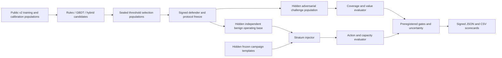

# APAR Defend v2 Evaluation Design

**Status:** Design approved in chat on 2026-08-20; no v2 code, population, or
evaluation has been executed

**Branch:** `codex/apar-defend`

**Base evidence:** Defend v1, frozen at commit `6ef013f` and later pinned
evidence commits

**Scope:** A synthetic-only, preregistered competition protocol for comparing
rules-only, GBDT-only, and layered-hybrid Defend arms under matched conditions.

## 1. Decision and purpose

Defend v1 remains an immutable, valid negative result. It trained a deterministic
CatBoost candidate on 200 authenticated synthetic campaigns using 48 causal
features. Its threshold-selection sample contained 252 fraud and 84 legitimate
rows. Every one of its 28 threshold candidates needed at least six review cases:
`6 / 336 = 1.7857%`, above the preregistered 1% review-case cap. Consequently,
v1 recorded `status=no_promotion` at `threshold_selection`, froze no champion,
and did not release hidden evaluation.

That result is not a model-performance failure and does not authorize changing a
v1 constraint. It shows that a raw review-case rate over a deliberately
adversarially enriched sample is not a defensible production-workload estimator.
Defend v2 therefore separates adversarial efficacy testing from workload
estimation on an independently generated synthetic operating population.

V2 is an internal-validity protocol. Its results may describe performance in its
declared synthetic populations only. They must never be represented as estimates
of real fraud prevalence, live-production performance, or external validity.

## 2. Non-negotiable evidence preservation

V2 must not modify, regenerate, overwrite, recalculate, reinterpret, or make a
promotion claim from any v1 artifact. In particular, it must preserve byte-for-
byte the following evidence roots and their existing verifier tests:

- `docs/experiments/defense-v1-preregistration.json`
- `docs/experiments/defense-v1-result.json`
- `docs/experiments/defense-v1-run-manifests.json`
- `fixtures/defense/v1/`
- `tests/evaluation/test_frozen_defense_v1.py`

V2 will use a different protocol identifier, artifact root, signer scope,
population namespace, and scorecard schema family. It must reject any attempted
v1 artifact as a v2 input. Existing G0--G3 and Task 6 evidence remains historical
input provenance only; no frozen source file or signed evidence document is
modified by v2 implementation.

## 3. Design alternatives considered

| Design | Strength | Reason not selected |
| --- | --- | --- |
| Continue with the adversarial sample as the workload denominator | Simple and strongly tests attack coverage | Its fraud enrichment makes analyst capacity and customer-friction rates non-operational; this repeats v1's construct-validity problem. |
| Reweight the v1 threshold rows to an assumed prevalence | Cheap sensitivity calculation | The 84 legitimate rows remain too small and originate in the same enriched construction. Weighting cannot create independent benign variation or case-volume behavior. |
| **Two independent populations with frozen prevalence strata** | Separates efficacy from workload, supports both transaction and case metrics, and makes sensitivity explicit | Chosen. It is more work, but the only option that answers the two questions without conflating them. |

## 4. Architecture

The training, calibration, threshold-selection, adversarial-efficacy, and
operating-workload populations are pairwise disjoint by campaign, entity, time,
and generator seed. The restricted evaluator owns hidden generation, injection,
labels, and final aggregation. Defender code may receive only observation-time
data and sealed input/output contracts; it never receives hidden labels, hidden
seeds, stratum assignments, or outcomes.

## 5. Population protocol

### 5.1 Adversarial efficacy population

The challenge population is a campaign-rich test corpus. It has equal,
preregistered representation of the four existing executable fraud families and
all declared stress regimes. It measures conditional fraud detection and
resilience, not production workload. Campaign grouping remains intact; all events
from one campaign occur in exactly one partition.

It reports family and regime slices, including cold-entity, temporal holdout,
leave-one-family-out, missing-optional, availability-delay, compressed-burst,
benign-amount-shift, and cold-ID-remap conditions. The feature contract remains
strictly past-only: features at time `T` may use only sources with
`available_at < T`, and same-time decisions share a pre-event state.

### 5.2 Operating workload populations

The workload estimator begins with a benign-only synthetic operating base of
exactly 100,000 decision transactions over 28 synthetic days. It is generated
independently from all training and challenge populations and has no campaign or
entity overlap with them. The base includes all rails permitted by the frozen
protocol and records transaction time, entity identity, and case-window keys.

Three separate operating populations are made by injecting independently
generated, frozen campaign events into fresh benign bases while holding the total
denominator at 100,000 decision transactions:

| Stratum | Synthetic fraud transaction share | Fraud transactions | Family allocation |
| --- | ---: | ---: | --- |
| `low` | 0.10% | 100 | 25 per family |
| `medium` | 0.50% | 500 | 125 per family |
| `high` | 1.00% | 1,000 | 250 per family |

The injector replaces the requisite number of benign decision transactions and
preserves coherent campaign timelines, entity separation, and settlement lineage.
Its selection, placement, and replacement rules are deterministic from the
sealed seed ledger. These are deliberately transparent synthetic stress
conditions; they are not estimates of, nor calibrated to, real-world prevalence.

### 5.3 Sealed seed ledger

Before any v2 execution, the preregistration contains every public seed and the
SHA-256 commitment of every evaluator-only seed. The evaluator receives the
complete encrypted seed ledger; the defender side receives only commitments. The
public receipt later reveals a seed only when disclosure cannot expose an
unexecuted hidden population. The seed ledger identifies generation, split,
injection, model training, calibration, threshold selection, bootstrap, and
negative-control seeds separately.

## 6. Arms and matched operation

Every arm processes the same decision-time observations, feature matrix,
population streams, case-grouping rule, label-maturity policy, partitions,
latency environment, and operating budgets.

| Arm | Decision path |
| --- | --- |
| `rules_only` | The frozen deterministic rules and action policy only. |
| `gbdt_only` | The frozen CatBoost score, frozen calibration, and action policy only. |
| `layered_hybrid` | Deterministic integrity/rule actions first; remaining events use the frozen CatBoost score, calibration, and action policy. |

Each arm has its own thresholds, but thresholds are selected by the identical,
preregistered candidate grid, budget constraints, objective, tie-break order,
and maximum-attempt rule. A rule, score, threshold, or action may not vary by
family, prevalence stratum, hidden/development viewpoint, campaign, or outcome.

## 7. Action semantics and workload denominators

The protocol does not treat all interventions as analyst work.

| Action or metric | Numerator | Denominator | Gate role |
| --- | --- | --- | --- |
| Analyst review workload | Unique case groups sent to review | All operating decision transactions | At most 1.00% in every stratum |
| Customer challenge rate | Challenged operating transactions | All operating decision transactions | At most 2.00% in every stratum |
| False-decline rate | Legitimate transactions automatically declined | Legitimate operating transactions | At most 0.10% in every stratum |
| False interventions per 10k | Legitimate challenged plus legitimate declined transactions | All operating decision transactions | Reported for every stratum; a fixed scorecard safety field |
| Automatic integrity declines | All automatic integrity declines, split by fraud/legitimate truth | All operating decision transactions | Reported separately; legitimate subset is governed by false-decline gate |

A case is defined before execution as the union of events sharing the frozen
case key within a 24-hour synthetic review window. One case can contain multiple
transactions. The protocol reports both `review_cases / transactions` for
capacity planning and `reviewed_transactions / transactions` for exposure; it
does not silently exchange one denominator for the other. Daily review-case
counts and `case_precision_at_capacity` make the case-level workload auditable.

## 8. Metrics, budgets, and decision rule

### 8.1 Required reported metrics

The scorecard reports, for every arm and relevant population or stratum:

- precision, recall, F1, PR-AUC, ROC-AUC, calibration (ECE and reliability
  bins), and FPR;
- false declines, false interventions, automatic integrity declines, customer
  challenges, review cases, review transactions, cases per 10k, and daily case
  volume;
- preventable settled value, captured preventable settled value, escaped value,
  and their declared fractions;
- alert time from first decision-eligible signal to final action, including p50,
  p95, and the population denominator;
- feature/decision p95 latency and all undefined-metric denominators.

PR-AUC is the primary ranking-quality diagnostic for each operating stratum;
ROC-AUC remains a complementary discrimination result. Precision, F1, PR-AUC,
and review precision are never pooled across strata without first reporting the
stratum values and the exact declared weights.

### 8.2 Fixed gates

For an arm to be promotable, every required adversarial slice and all three
operating strata must pass:

| Gate | Requirement |
| --- | --- |
| Family coverage | Recall at least 0.50 for every fraud family on the adversarial efficacy population |
| Calibration | ECE at most 0.10 |
| Customer challenge | Challenge rate at most 2.00% in every operating stratum |
| Customer harm | False-decline rate at most 0.10% in every operating stratum |
| Analyst capacity | Review-case workload at most 1.00% in every operating stratum |
| Compute latency | p95 model decision latency at most 50 ms in the declared single-process CPU environment |
| Value protection | Captured preventable settled value at least 50.0% and escaped value at most 50.0% for every required adversarial family slice |
| Time to alert | p95 time from first eligible signal to action at most 300 synthetic seconds for every required adversarial family slice |

Threshold selection maximizes the preregistered value-protection objective
subject to every applicable gate on sealed threshold-selection populations. The
tie-break sequence is: higher minimum family captured-value fraction, lower
maximum review-case workload, lower maximum false-decline rate, lower maximum
challenge rate, lower p95 latency, then lexicographically smallest threshold
tuple. An absent or undefined required metric fails closed.

The v2 result is `no_promotion` if no arm qualifies. A qualifying arm is a
candidate only; hidden-evaluator validation and signed publication are still
required before a judge-facing scorecard can say `promotion_eligible`.

## 9. Uncertainty, controls, and stopping

Uncertainty uses a two-level, stratified block bootstrap with 2,000 replicates:
resample synthetic days first and campaign/entity case groups within day second.
The bootstrap seed and percentile interval definition are preregistered. Every
reported rate, value fraction, and time metric includes a 95% interval. A hard
gate uses the conservative direction of its 95% bound: lower bound for minimum
requirements and upper bound for maximum requirements. Point estimates never
override a failing conservative bound.

The independent evaluator runs exactly one confirmatory hidden evaluation after
the full preregistration, source revision, defender bundle, and threshold
artifacts have been sealed. A failed gate, invalid control, malformed artifact,
or evaluator-separation breach ends the confirmatory path as `no_promotion`.
There is no rerun, adaptive seed replacement, threshold revision, or metric
switch. Later exploration must receive a new protocol identifier and cannot be
presented as confirmatory v2 evidence.

Two controls are mandatory:

1. A benign-only operating control verifies zero fraud claims and reports all
   customer and analyst interventions.
2. A hidden, block-preserving score-permutation control verifies that the metric
   and reporting pipeline cannot create a positive efficacy claim without score
   signal. Any apparently qualifying efficacy result invalidates the run.

## 10. Preregistration and pre-execution gates

No v2 population or hidden evaluation may be generated until a canonical,
signed preregistration exists. It must include:

- this population composition, every seed/commitment, generator revision,
  campaign ledger, case key, injection rule, and all split assignments;
- all model/rule candidates, feature catalog hash, calibration candidates,
  threshold candidate grid, selection objective, tie-breaks, and arm semantics;
- every budget, metric formula, undefined-metric behavior, bootstrap procedure,
  confidence-bound gate rule, negative control, and maximum attempt count;
- evaluator authority identity, public-key binding, capabilities, allowed
  imports, network prohibition, input/output schemas, and signed-artifact
  manifest format;
- stable JSON and CSV schema versions and a mandatory `synthetic_scope` field;
- explicit statement that the protocol makes no real-world prevalence or
  external-validity claim.

The pre-execution verifier fails closed unless it can verify all signatures and
hashes, that v1 roots are unchanged, that partitions are cold and disjoint, that
feature provenance is past-only, that all arms have identical non-decision
inputs, that no evaluator-only import is reachable from defender code, and that
no v2 artifact already exists under the proposed protocol identifier.

### 10.1 Defender language and process boundary

Source admission is a positive capability policy, not a claim that Python can
be sandboxed by a denylist. The byte-exact defender and feature files named by
the sealed source manifest, plus the verifier-pinned data-contract dependencies,
retain their audited frozen compatibility surface. Non-frozen code may import
only the exact public data-contract modules, feature namespace, and v2 protocol
contract named by the verifier; every allowed local import is scanned
recursively. Every other defender-reachable Python file must use only the
verifier's explicit AST-node, attribute, and static-import allowlists. Dynamic
imports, lambdas,
dunder access, runtime-introspection modules, reflection, dynamic code, and any
syntax or capability absent from those allowlists fail admission. The same rule
applies transitively to reachable feature and local package modules.

The sole public evaluator import, `apar.evaluation.v2_protocol`, is not exempt
from graph closure. Its module and executable `apar.evaluation` package
initializer must both match verifier-pinned SHA-256 values and are scanned as
reachable source. All other evaluator modules remain forbidden terminal nodes;
the scanner neither admits nor recursively inventories them.

An eventual v2 evaluator must also enforce an operating-system process boundary:
defender code runs in a fresh process whose address space has never loaded
evaluator modules and which has no evaluator signing key, seed material, receipt
store, module cache, writable evaluator source, or network access. No Python
object, pickle, file descriptor, shared memory, callback, or module reference may
cross that boundary. Inputs and outputs cross only as canonical JSON/CSV bytes
whose digests bind the sealed preregistration ID and execution nonce; the
evaluator verifies inbound digests and signs outbound receipts and scorecards.
The present repository performs only read-only pre-execution admission, so it
does not claim that this runtime isolation has occurred or that v2 was executed.

## 11. Scorecard contracts

V2 introduces versioned, canonical output contracts rather than changing v1
scorecards:

- `defense-v2-scorecard.json`: signed overall result, limitations, protocol and
  population manifest digests, arm records, gate outcomes, and synthetic scope.
- `defense-v2-arm-metrics.csv`: one row per arm × population × stratum × slice,
  with all classification, calibration, action, value, and time metrics.
- `defense-v2-workload.csv`: one row per arm × operating stratum × day, with
  transaction and case denominators, action counts, and capacity metrics.
- `defense-v2-gates.json`: canonical per-gate point estimate, interval, bound
  used, pass/fail, undefined state, and lineage references.
- `defense-v2-limitations.md`: synthetic-only scope, unmeasured risks,
  assumptions, and non-claims.

No leaderboard may rank an arm while suppressing a failed gate. Scorecards list
all three arms in stable order and show `no_promotion` when appropriate.

## 12. Simulation Fidelity Validation integration

The separately completed Simulation Fidelity Validation programme is not assumed
to be present in this repository. V2 can reference it only through a separately
verified, versioned, hash-pinned evidence bundle explicitly named in the v2
preregistration. The bundle may define generator-adequacy limitations or entry
criteria; it cannot add data, change a seed, revise a metric, or alter a budget
after preregistration. Findings that arrive after the v2 freeze can motivate a
new v3 protocol only.

## 13. Implementation boundaries and tests

Implementation will be TDD and additive. Expected modules are a v2 protocol
contract, independent benign generator and frozen injector, case-workload
aggregator, multi-stratum threshold selector, gate/uncertainty evaluator,
scorecard renderer, and a v2 pre-execution verifier. Existing v1 code remains
read-only dependency and frozen-v1 tests run unchanged.

Tests must cover at least:

- v1 byte/hash preservation and v2 rejection of v1 artifact reuse;
- population independence, exact denominator, stratum allocation, campaign
  coherence, and seed-commitment verification;
- past-only features and cold entity/time/family isolation across every v2
  partition;
- action-specific transaction and case denominators, including multiple events
  in one review case;
- matched arm inputs, threshold tie-break determinism, and a failure in any
  stratum preventing promotion;
- bootstrap block construction and conservative confidence-bound gates;
- negative-control invalidation, one-attempt stopping, evaluator capability
  isolation, canonical signing, and JSON/CSV schema snapshots.

## 14. Acceptance criteria

The implementation is complete only when all new tests and all frozen-v1 tests
pass; `verify_g3` remains green; the new pre-execution verifier accepts a sealed
preregistration but no v2 evaluation has been run; and the prototype-ready
contracts can render a truthful `not_executed` state. Hidden evaluation is a
separate, explicitly authorized step after those gates pass.
