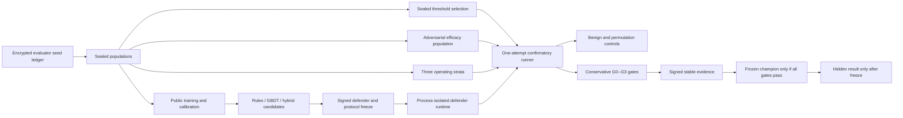

# APAR Defend v3 Evaluation Design

**Status:** Draft protocol revision; no v3 code, population, or evaluation has
been executed

**Branch:** `codex/apar-baseline`

**Base evidence:** Defend v1 remains frozen and immutable; Defend v2 remains a
sealed, admissible, unexecuted protocol at commit
`f1d1b355751d8e24d59a7a28e4a67e342d81cdf3`

**Scope:** A separately versioned, synthetic-only execution protocol that
completes the missing evaluator-owned path for rules-only, GBDT-only, and
layered-hybrid competition evidence without reopening or modifying v2.

## 1. Decision and purpose

Defend v2 is scientifically admissible but intentionally incomplete. It seals
population contracts, workload semantics, conservative gates, negative controls,
preregistration, and signed `not_executed` reporting. It does not contain the
evaluator-owned encrypted seed ledger, complete adversarial efficacy population,
process-isolated defender runtime, end-to-end confirmatory runner, durable
one-attempt receipt flow, or completed evidence renderer needed to execute the
sealed protocol.

V3 therefore exists to close exactly those execution gaps. It must not change
any v2 metric, seed commitment, population denominator, budget, gate, threshold
rule, stopping rule, arm definition, or hidden evaluation semantics. Any change
beyond execution plumbing would require a different protocol identifier and a
fresh preregistration.

V3 results remain synthetic-only. They must never be represented as estimates of
real fraud prevalence, live-production performance, or external validity.

## 2. Evidence preservation

V3 must preserve byte-for-byte all Defend v1 roots and all Defend v2 protocol
inputs, tests, and `not_executed` evidence:

- `docs/experiments/defense-v1-preregistration.json`
- `docs/experiments/defense-v1-result.json`
- `docs/experiments/defense-v1-run-manifests.json`
- `fixtures/defense/v1/`
- `config/defense/competition-v2-preregistration.json`
- `config/defense/competition-v2-profile.json`
- `config/defense/competition-v2-manifests.json`
- `scripts/verify_defense_v2_preexecution.py`
- all existing `v2_*` implementation and test modules
- Task 6 evidence and all G0--G3 evidence roots

V3 uses a distinct `apar-defend-v3` protocol identifier, artifact root, signer
scope, population namespace, execution receipt namespace, and scorecard schema
family. It must reject v1 and v2 artifacts as v3 inputs and must never import or
mutate v2 evaluator state.

## 3. Architecture

The evaluator owns all hidden generation, labels, seed material, stratum
assignment, controls, and aggregation. Defender code observes only sealed
observation-time contracts and runs in a fresh process with no evaluator module,
authority key, seed, receipt store, writable evaluator source, network access,
or shared Python object.

## 4. Sealed seed ledger

V3 must introduce an evaluator-only encrypted seed ledger before any population
or model work. The public preregistration binds only SHA-256 commitments.

Required separately named seeds are:

1. benign operating generation;
2. campaign injection;
3. adversarial efficacy generation;
4. public training;
5. public calibration;
6. sealed threshold selection;
7. model training;
8. calibration fitting;
9. threshold candidate generation;
10. bootstrap;
11. benign-only control;
12. score-permutation control;
13. hidden evaluation.

The ledger payload must be sealed with an evaluator-held symmetric key using an
authenticated encryption mode. It must record a schema version, protocol ID,
payload digest, key ID, nonce, ciphertext digest, and commitment list. A seed may
be revealed only after its population is complete and its disclosure cannot
expose an unexecuted hidden population.

## 5. Populations

V3 reuses v2's operating population semantics exactly:

| Stratum | Transactions | Fraud transactions | Family allocation |
| --- | ---: | ---: | --- |
| `low` | 100,000 | 100 | 25 per family |
| `medium` | 100,000 | 500 | 125 per family |
| `high` | 100,000 | 1,000 | 250 per family |

It adds a sealed adversarial efficacy population with equal representation of
the four executable families and all declared stress regimes. Training,
calibration, threshold selection, efficacy, and each operating stratum must be
pairwise disjoint by campaign, entity, time horizon, and generator seed.

Every partition must preserve campaign grouping, strict `available_at <
decision_at` feature causality, cold-entity and cold-time cohorts, chronological
holdout, regime slices, and held-out-family isolation. The evaluator must record
an immutable population manifest for each partition with exact denominators,
digests, seed commitment references, and disjointness proofs.

## 6. Arms and execution boundary

The three arms remain:

1. `rules_only`: frozen deterministic rules and action policy only.
2. `gbdt_only`: frozen calibrated CatBoost score and action policy only.
3. `layered_hybrid`: deterministic integrity/rule actions first, then calibrated
   CatBoost scoring for remaining events.

All arms receive identical observations, feature matrices, partitions, case
grouping, latency environment, threshold candidate shape, budgets, and stopping
rules. Only decision logic and its selected threshold tuple may differ.

The v3 runner must execute each defender arm in a fresh subprocess whose initial
Python state has not imported `apar.evaluation`, `apar.evaluation_hidden`, or
any other evaluator module. Inputs and outputs cross only as canonical JSON or
CSV bytes bound to the protocol ID and execution nonce. The parent must verify
inbound and outbound digests, reject shared memory, file descriptors, pickles,
callbacks, module references, and network access, and terminate cleanly on any
boundary violation.

## 7. Confirmatory execution and stopping

V3 permits exactly one confirmatory execution after all of the following are
sealed and independently reviewed:

1. signed v3 preregistration;
2. immutable source and configuration inventory;
3. encrypted seed ledger and public commitments;
4. population manifests and disjointness proofs;
5. frozen defender bundle for every arm;
6. threshold candidate grid and selection rule;
7. process-isolation capability manifest;
8. metric, bootstrap, controls, budget, and reporting manifests;
9. explicit user approval immediately before execution.

Any malformed input, failed gate, invalid control, boundary violation, crash, or
timeout terminates the confirmatory path as truthful `no_promotion`. There is no
rerun, retuning, seed replacement, threshold revision, metric switch, or hidden
result opening after failure.

## 8. Metrics and gates

V3 reports the same required evidence as the approved v2 design: precision,
recall, F1, PR-AUC, ROC-AUC, ECE, reliability bins, Brier score, FPR, challenge
rate, false-decline rate, review cases and reviewed transactions, false
interventions, automatic integrity declines, preventable settled value, escaped
value, time-to-alert percentiles, decision latency, campaign reconstruction,
chronological, cold-entity, regime, and held-out-family slices.

Every rate, value fraction, and time metric uses the preregistered two-level
day/case-block bootstrap with 2,000 replicates and reports a 95% interval. Hard
gates use the conservative bound. Undefined required metrics fail closed.

Promotion requires every arm gate to pass for every required slice and stratum.
The fixed gates are:

| Gate | Requirement |
| --- | --- |
| Family coverage | Recall >= 0.50 for every fraud family |
| Calibration | ECE <= 0.10 and preregistered Brier reporting |
| Customer challenge | Challenge rate <= 2.00% in every stratum |
| Customer harm | False-decline rate <= 0.10% in every stratum |
| Analyst capacity | Review cases / transactions <= 1.00% in every stratum |
| Compute latency | p95 model decision latency <= 50 ms |
| Value protection | Captured preventable settled value >= 50.0% and escaped value <= 50.0% per family |
| Time to alert | p95 time-to-alert <= 300 seconds per family |

The selection objective and deterministic tie-break sequence remain identical to
v2: maximize the minimum family captured-value lower bound; then minimize
maximum review-case rate, maximum false-decline rate, maximum challenge rate,
p95 latency, and lexicographic threshold tuple.

## 9. Mandatory controls

The benign-only control must process an all-benign operating population and
verify zero fraud claims while reporting every challenge and decline.

The score-permutation control must preserve day/case blocks, permute scores,
and reject any apparently qualifying efficacy signal. Both controls require
evaluator signatures bound to the exact arm, candidate input digest, preregistration
ID, execution nonce, and evaluator public identity.

## 10. Receipts and publication

The runner must atomically create a signed execution receipt before consuming
the one attempt. The receipt binds the preregistration ID, execution nonce,
source tree digest, configuration manifest digest, defender bundle digest,
population manifest digest, evaluator identity, UTC start and end timestamps,
and terminal status. A crash after receipt creation still consumes the attempt.

Publication must emit stable canonical JSON and CSV artifacts:

1. `defense-v3-scorecard.json`;
2. `defense-v3-arm-metrics.csv`;
3. `defense-v3-workload.csv`;
4. `defense-v3-gates.json`;
5. `defense-v3-limitations.md`;
6. signed model, threshold, dataset, metric, and scorecard manifests;
7. signed execution receipt.

Every artifact must preserve all three arms, all gate outcomes, all failed and
undefined metrics, and the synthetic non-claim. `promotion_eligible` is valid
only when every arm gate passes and the defender is frozen. A hidden result may
be opened only after that legitimate freeze.

## 11. Implementation boundaries and tests

V3 is additive and test-first. Required modules are a seed-ledger contract,
efficacy population builder, disjointness auditor, process-isolation capability
manifest, defender subprocess adapter, matched arm replay orchestrator, metric
projection and bootstrap bridge, controls runner, one-attempt runner, receipt
store, completed scorecard renderer, and read-only pre-execution verifier.

Tests must cover at least:

- exact v1/v2 byte and hash preservation;
- canonical preregistration, signature, and manifest rejection;
- encrypted seed-ledger integrity, commitment binding, and disclosure policy;
- population denominators, family allocation, disjointness, causality, and
  campaign integrity;
- fresh-process isolation and evaluator-import denial;
- canonical input/output framing and digest verification;
- matched arm execution and deterministic threshold selection;
- conservative bootstrap gates and undefined-metric failure;
- signed controls and replay rejection;
- atomic one-attempt receipt consumption and crash semantics;
- truthful signed `no_promotion` and `promotion_eligible` rendering;
- stable JSON/CSV schema snapshots;
- frozen champion gating and hidden-result ordering.

## 12. Acceptance criteria

V3 is implementation-ready only when the full test suite and G0--G3 gates pass,
v1/v2 evidence remains byte-for-byte unchanged, and the v3 pre-execution verifier
reports `not_executed`. Execution requires a second explicit approval after
independent review. A failed or passed confirmatory run must produce immutable
signed evidence exactly once.
