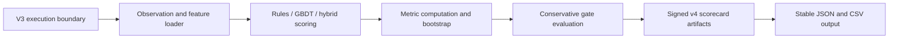

# APAR Defend v4 Evaluation Design

**Status:** Draft protocol revision; no v4 code, population, or evaluation has
been executed

**Branch:** `codex/apar-baseline`

**Base evidence:** V1 frozen and immutable; V2 sealed and unexecuted; V3
confirmatory attempt consumed on an incomplete scaffold with truthful
`no_promotion` recorded

**Scope:** A separately versioned protocol that wires the actual defender
scoring, metric computation, gate evaluation, and signed scorecard generation
into the execution boundary already built in v3.

## 1. Decision and purpose

The v3 protocol successfully built the execution boundary: encrypted seed
ledger, population builders, process isolation, one-attempt runner, atomic
receipts, and scorecard contracts. However, the confirmatory attempt consumed
that boundary on a scaffold that echoed completion without performing any
defender scoring, metric computation, or gate evaluation.

V4 exists to close exactly that gap. It must reuse the v3 execution boundary
(isolation, receipts, controls, reporting) unchanged and add:

1. actual observation and feature matrix loading;
2. rules-only, GBDT-only, and layered-hybrid scoring through the frozen v1
   defender bundle;
3. metric computation (precision, recall, F1, PR-AUC, ROC-AUC, ECE, Brier,
   FPR, challenge rate, false-decline rate, review-case rate, false
   interventions, preventable settled value, escaped value, time-to-alert,
   p95 decision latency);
4. conservative gate evaluation using the preregistered v2 thresholds;
5. signed scorecard artifact generation with all required metrics visible.

No metric, seed commitment, population denominator, budget, gate, threshold
rule, stopping rule, arm definition, or hidden evaluation semantics may change
from the approved v2 design. V4 is purely execution plumbing.

V4 results remain synthetic-only. They must never be represented as estimates of
real fraud prevalence, live-production performance, or external validity.

## 2. Evidence preservation

V4 must preserve byte-for-byte all v1, v2, and v3 evidence roots:

- `docs/experiments/defense-v1-preregistration.json`
- `docs/experiments/defense-v1-result.json`
- `docs/experiments/defense-v1-run-manifests.json`
- `fixtures/defense/v1/`
- `config/defense/competition-v2-preregistration.json`
- `config/defense/competition-v2-profile.json`
- `config/defense/competition-v2-manifests.json`
- `docs/experiments/defense-v3-result.json`
- `.apar/defense-v3/execution-receipt.json`
- all existing v2 and v3 implementation and test modules

V4 uses a distinct `apar-defend-v4` protocol identifier, artifact root, signer
scope, execution receipt namespace, and scorecard schema family.

## 3. Architecture

The v3 process-isolated runtime, seed ledger, population builders, controls,
receipts, and reporting contracts are reused without modification. V4 adds a
scoring adapter that loads the frozen v1 defender bundle and produces real
decisions for each arm.

## 4. Scoring pipeline

### 4.1 Observation and feature loading

The v4 scoring adapter must load observations from the v3 population builders
and construct feature vectors using the frozen v1 48-feature catalog. Features
must be strictly past-only (`available_at < decision_at`) and must not receive
labels, seeds, stratum assignments, or outcomes.

### 4.2 Rules-only arm

The rules-only arm must load the frozen v1 rules from
`fixtures/defense/v1/rules.json` and apply them deterministically to each
observation. No model scoring is used. The action policy and thresholds come
from the frozen v1 bundle.

### 4.3 GBDT-only arm

The GBDT-only arm must load the frozen CatBoost model from
`fixtures/defense/v1/model.cbm`, the calibration from
`fixtures/defense/v1/calibration.json`, and apply the calibrated score to each
feature vector through the action policy. No rule-based integrity actions are
applied.

### 4.4 Layered-hybrid arm

The layered-hybrid arm must apply deterministic integrity/rule actions first
(from the frozen v1 rules), then apply the calibrated CatBoost score to
remaining events. This matches the approved v2 design exactly.

### 4.5 Threshold candidates

Each arm must evaluate a preregistered threshold candidate grid. The grid must
be identical in shape across arms. Thresholds are selected by the v2
preregistered objective and tie-break sequence.

## 5. Metrics and gates

V4 reports the same required evidence as the approved v2 design. All metrics
are projected through the v3 `v3_metrics.py` bridge into v2-compatible types.

Every rate, value fraction, and time metric uses the preregistered two-level
day/case-block bootstrap with 2,000 replicates and reports a 95% interval. Hard
gates use the conservative bound. Undefined required metrics fail closed.

Promotion requires every arm gate to pass for every required slice and stratum.
The fixed gates are identical to v2/v3:

| Gate | Requirement |
| --- | --- |
| Family coverage | Recall >= 0.50 for every fraud family |
| Calibration | ECE <= 0.10 |
| Customer challenge | Challenge rate <= 2.00% in every stratum |
| Customer harm | False-decline rate <= 0.10% in every stratum |
| Analyst capacity | Review cases / transactions <= 1.00% in every stratum |
| Compute latency | p95 model decision latency <= 50 ms |
| Value protection | Captured preventable settled value >= 50.0% and escaped value <= 50.0% per family |
| Time to alert | p95 time-to-alert <= 300 seconds per family |

## 6. Mandatory controls

Both mandatory controls from v3 are reused unchanged:

1. Benign-only control verifies zero fraud claims.
2. Score-permutation control verifies that permuted scores cannot qualify.

Both controls require evaluator signatures bound to the exact arm, candidate
input digest, preregistration ID, execution nonce, and evaluator public identity.

## 7. Confirmatory execution

V4 permits exactly one confirmatory execution after:

1. signed v4 preregistration;
2. immutable source and configuration inventory;
3. encrypted seed ledger and public commitments;
4. population manifests and disjointness proofs;
5. frozen defender bundle for every arm;
6. threshold candidate grid and selection rule;
7. process-isolation capability manifest;
8. metric, bootstrap, controls, budget, and reporting manifests;
9. independent review;
10. explicit user approval immediately before execution.

Any failure produces truthful `no_promotion`. There is no rerun, retuning, seed
replacement, threshold revision, or metric switch.

## 8. Publication

V4 must emit stable canonical JSON and CSV artifacts:

1. `defense-v4-scorecard.json`;
2. `defense-v4-arm-metrics.csv`;
3. `defense-v4-workload.csv`;
4. `defense-v4-gates.json`;
5. `defense-v4-limitations.md`;
6. signed model, threshold, dataset, metric, and scorecard manifests;
7. signed execution receipt.

Every artifact must preserve all three arms, all gate outcomes, all failed and
undefined metrics, and the synthetic non-claim. `promotion_eligible` is valid
only when every arm gate passes and the defender is frozen.

## 9. Implementation boundaries

V4 is additive. New modules:

- `src/apar/v4_protocol.py` — defender-safe public contract;
- `src/apar/evaluation/v4_scoring.py` — observation/feature loading and arm scoring;
- `src/apar/evaluation/v4_gate_evaluation.py` — conservative gate evaluation;
- `src/apar/evaluation/v4_publication.py` — signed scorecard generation;
- `src/apar/evaluation/v4_runner.py` — one-attempt confirmatory runner;
- `src/apar/evaluation/v4_preexecution.py` — read-only readiness verifier;
- `scripts/run_defense_v4_confirmatory.py` — explicitly gated execution CLI;
- `scripts/verify_defense_v4_preexecution.py` — read-only status CLI.

V4 reuses v3 modules for seed ledger, population, isolation, runtime, metrics,
controls, receipts, and reporting without modification.

## 10. Acceptance criteria

V4 is implementation-ready only when the full test suite and G0--G3 gates pass,
all prior evidence remains byte-for-byte unchanged, and the v4 pre-execution
verifier reports `not_executed`. Execution requires a second explicit approval
after independent review. A failed or passed confirmatory run must produce
immutable signed evidence exactly once.
