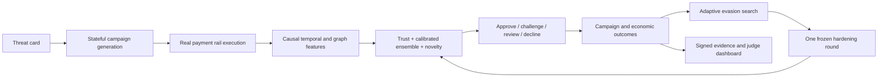

# APAR Sentinel v5: Campaign-Aware Relational Defense Design

**Status:** Approved implementation authority for the next development task  
**Date:** 2026-08-22  
**Owner:** Dylan Moraes (`@Dljdd`)  
**Repository baseline:** `codex/apar-baseline` at or after `f1d1b355751d8e24d59a7a28e4a67e342d81cdf3`  
**Execution plan:** `docs/superpowers/plans/2026-08-22-apar-sentinel-v5.md`

## 1. Decision

Build **APAR Sentinel v5**, a campaign-aware relational fraud-defense system that combines:

1. deterministic payment-integrity and lifecycle rules;
2. causal, history-only transaction, temporal, relational, and campaign features;
3. a calibrated CatBoost ensemble;
4. an out-of-distribution/uncertainty detector used for challenge or review, never as a stand-alone decline signal;
5. an explicit four-action operating policy: approve, challenge, review/hold, or decline;
6. an adaptive red-team hardening loop evaluated on untouched campaigns and seeds.

The purpose of v5 is not to invent another model family. It is to produce credible evidence that the APAR simulator, adversarial search, trust plane, and defender work together under the competition's actual operating constraints: novel attacks, class imbalance, delayed labels, false-positive cost, strict latency, and changing adversaries.

This design supersedes the experimental modeling direction used in the detached v4 worktree. It does **not** modify, relabel, or replace any v1-v4 evidence.

## 2. Why this is the highest-probability approach

The current repository already contains most of the difficult infrastructure:

- deterministic, stateful payment rails;
- causal time ordering and immutable artifacts;
- four fraud/threat families;
- a trust verifier for agentic payments;
- adaptive attack generation;
- a causal feature store;
- CatBoost, calibration, policy, and evaluation components;
- signed, replayable experiment boundaries.

The principal gap is not missing model complexity. It is the lack of a fully mixed, behaviorally credible development corpus and a statistically valid end-to-end defender experiment. The failed v4 result demonstrates this precisely: its population contained only 32 fraudulent rows and no legitimate activity, predictions were nearly constant, calibration and time-to-alert were undefined, and workload could not be evaluated. No classifier can produce competition-grade evidence from that experiment.

The research points to a practical architecture:

- graph-derived features plus gradient-boosted trees are a strong tabular baseline and can match materially deeper graph models when evaluation is causal;
- row-independent synthetic generators miss burst, velocity, lifecycle, and multi-entity behavior;
- production fraud systems combine machine learning, rules, identity signals, review, and calibrated actions rather than making every high score an automatic decline;
- temporal splits, group separation, delayed feedback, alert budgets, and concept drift determine whether offline results are operationally meaningful;
- agentic commerce requires cryptographic identity, intent, scope, freshness, replay protection, and authorization binding before risk scoring.

Accordingly, v5 focuses novelty where it matters: a **closed-loop adversarial payment range** that generates causally valid campaigns, trains a campaign-aware defender, discovers evasions, hardens once, and produces replayable evidence across four payment threat families.

## 3. Competition alignment

The submission story must be visible in the product and evidence:

| Competition need | APAR Sentinel v5 response |
|---|---|
| Identify emerging payment threats | Typed threat cards, campaign features, temporal motifs, novelty and ensemble disagreement |
| Generate realistic scenarios | Stateful rail execution, economic conservation, lifecycle constraints, benign/fraud mixtures, relational fidelity checks |
| Defend against threats | Trust checks, calibrated supervised risk, uncertainty routing, explicit operating policy |
| Adapt to new attacks | Valid campaign-parameter search followed by one frozen hardening round |
| Demonstrate responsible operation | Causal features, false-positive/workload gates, provenance, replay, finite metrics, no hidden-test tuning |
| Explain value to judges | Per-family attack journeys, decisions, reason families, latency, captured value, workload, before/after hardening |

The eventual walkthrough should present one continuous loop:



## 4. Authority and evidence boundaries

### 4.1 Frozen history

The implementation must not change the bytes, claims, labels, or outcome interpretation of:

- defense v1 frozen artifacts and reports;
- defense v2 preregistration, sealed configuration, or any future result;
- Task 6 v3.4 preregistration/result and its portable verifier;
- prior Task 7 run evidence;
- the detached v4 experiment.

V4 remains a negative experiment. It must not be merged as positive competition evidence.

### 4.2 New namespace

All v5 protocol, population, model, evaluation, and report code must live in new v5-specific files or new non-frozen shared modules. Existing frozen configs may be read, but not silently edited.

### 4.3 Development versus confirmatory evidence

V5 work in this task is **development evidence only**.

- Development data, seeds, thresholds, and reports must be named as such.
- The agent may run repeatable development experiments.
- The agent must not run v2 hidden evaluation, any sealed confirmatory evaluation, or any one-shot holdout.
- A future confirmatory protocol must be preregistered in a separate task after development is finite, reproducible, and independently reviewed.

### 4.4 Authorship

If commits are made, every commit must use:

```text
Name: Dylan Moraes
Email: dylanmoraesdljdd@gmail.com
Account: @Dljdd
```

No commit, co-author trailer, report, or generated metadata may identify ChatGPT, Codex, OpenAI, or an AI agent as an author.

## 5. Current assets to reuse

The agent must inspect and reuse these assets before introducing new abstractions:

| Capability | Existing location |
|---|---|
| Rail simulator and ledger | `src/apar/simulator/`, `src/apar/rails/` |
| Four campaign families | `src/apar/generators/campaigns.py` |
| Population generation | `src/apar/generators/population.py` |
| Trust verification | `src/apar/trust/verifier.py` |
| Causal feature state | `src/apar/features/state.py` |
| Existing feature catalog | `config/defense/feature-catalog.json` |
| Rules, CatBoost, calibration, policy | `src/apar/defense/` |
| Adaptive attacker | `src/apar/redteam/search.py`, `src/apar/redteam/policies.py` |
| Replay-backed benchmark | `src/apar/redteam/benchmark.py` |
| Independent mixed-population work | `src/apar/evaluation/v2_population.py` |
| Evaluation and reporting contracts | `src/apar/evaluation/v2_*.py` |
| G1/G2 and historical verification | `scripts/verify_g1_g2.py` and Task 6 verifier scripts |

New implementation should be thin orchestration around proven components. Duplication of the rail, ledger, trust verifier, or adaptive-search implementation is prohibited.

## 6. Corpus and split design

### 6.1 Unit of prediction

The primary prediction unit is a payment attempt at its decision timestamp. Every feature must be computable from information whose source timestamp is strictly earlier than the decision timestamp, plus fields carried by the current signed request.

The corpus must retain campaign, actor, counterparty, account, device/credential, merchant/payee, and lifecycle identifiers for splitting and audit. Identifiers must not be used as raw predictive features.

### 6.2 Mixed operating population

Every evaluation split must contain legitimate and fraudulent activity. The production-size development profile must include at least:

- 50,000 legitimate payment decisions in the untouched development test;
- all four threat families;
- at least 100 distinct malicious campaigns per family in the untouched development test;
- legitimate recurring, first-time, high-value, bursty, refund, return, challenge, and recovery activity;
- multiple actors, merchants/payees, devices/credentials, accounts, and time zones where the existing contracts support them.

Smaller deterministic smoke profiles are allowed for tests, but their reports must say `smoke` and may not be used for readiness claims.

### 6.3 Required split order

Use chronological, group-disjoint partitions:

1. **train** — fit model parameters;
2. **calibration** — fit probability calibration only;
3. **threshold** — choose operating thresholds under frozen workload constraints;
4. **development test** — untouched until all model and policy code is frozen for that development run;
5. **adaptive hardening train** — campaigns found by the attacker and approved for one retraining round;
6. **adaptive holdout** — different seeds and campaign identities, untouched by attacker/model selection.

No actor, account, campaign, device/credential, or merchant/payee identity may cross partitions. If an entity type is unavailable for a family, the split report must record that fact rather than pretending separation was checked.

### 6.4 Family and generator isolation

In addition to the ordinary mixed test, v5 must run:

- leave-one-family-out evaluation for each family;
- leave-one-generator-version-out or held-parameter-region evaluation;
- cold-identity evaluation using remapped, unseen identifiers;
- time-shift evaluation in a later simulation window.

These are robustness experiments, not substitutes for the primary mixed-population result.

### 6.5 Leakage prohibitions

The feature matrix and model must not receive:

- fraud labels or outcome fields unavailable at decision time;
- family names, campaign IDs, scenario IDs, generator seeds, or split labels;
- future events or equal-timestamp events from other transactions;
- current-event decision outcome, later chargeback/refund/return outcome, or final recovered value;
- raw synthetic naming conventions from which family or label can be decoded;
- adaptive evaluator objectives or hidden validity reasons.

Tests must verify these restrictions mechanically.

## 7. Behavioral fidelity contract

Passing JSON schemas is not sufficient. Each generated corpus must pass a fidelity audit in four dimensions.

### 7.1 Statistical fidelity

Compare legitimate and malicious strata independently for:

- amount quantiles and heavy-tail behavior;
- inter-arrival quantiles;
- hour-of-day/day-of-week distributions;
- decline, challenge, refund, return, and recovery rates;
- actor, counterparty, account, device/credential, and merchant/payee concentration;
- new-versus-established relationship rates.

The audit must report distances, reference bounds, observed values, and pass/fail. A test may use deterministic tolerances; a development protocol must freeze them before the untouched test is read.

### 7.2 Temporal fidelity

Measure and require family-specific behavior such as:

- card testing: probe burst precedes escalation and successful authorization;
- APP scam/mule: victim funding precedes fan-in, layering, fan-out, cash-out, return/freeze/recovery;
- synthetic merchant/refund: purchase precedes settlement and abuse of refund/chargeback/recovery lifecycle;
- agentic intent abuse: authorization/identity/scope failure or valid control occurs before a terminal payment decision.

At minimum, audit inter-arrival dispersion, burst size, retry depth, lifecycle ordering, and time-to-terminal outcome.

### 7.3 Relational/graph fidelity

Build a temporal heterogeneous graph from actors, counterparties, accounts, devices/credentials, merchants/payees, and payments. Audit:

- in/out degree and weighted degree distributions;
- fan-in/fan-out;
- repeated-edge concentration;
- shared-neighbor and two-hop exposure;
- component sizes and local density;
- motif counts relevant to each family;
- new-node and new-edge rates over time.

Graph statistics must be history-only at decision time. Full-corpus graph calculations may be used only for post-run fidelity reports, never as model features.

### 7.4 Economic and lifecycle fidelity

Every accepted campaign must replay on the production rail and ledger, conserve value under the rail's declared fee/hold/reversal semantics, and contain the required causal lifecycle. Fragmented or label-only motifs fail closed.

The audit must distinguish:

- attempted amount;
- approved amount;
- settled gross amount;
- returned/refunded/charged-back amount;
- recovered/frozen amount;
- role-bound attacker net value;
- victim or issuer/merchant loss where applicable.

### 7.5 Failure behavior

If a production-size development corpus fails any mandatory fidelity check, the run result is `invalid_corpus`. Model metrics may be retained diagnostically, but they cannot support readiness or competition claims.

## 8. Feature system

Create a versioned v5 feature catalog. Do not alter the frozen historical catalog in place.

### 8.1 Transaction and request features

- amount, currency, rail, channel, product/category where available;
- hour/day cyclic encodings;
- signed request, identity, mandate, intent, scope, authentication, nonce/freshness indicators from the public trust result;
- data-quality/missingness flags.

### 8.2 Stateful behavioral features

For actor, counterparty, pair, account, device/credential, and merchant/payee where supported:

- counts and sums over 1 minute, 5 minutes, 1 hour, 24 hours, and 7 days;
- prior declines/challenges/returns/refunds/recoveries;
- time since previous event and previous successful event;
- distinct counterparties and new-relationship flags;
- rolling amount deviation and robust z-score;
- retry depth and burst position.

### 8.3 Temporal graph features

- history-only in/out degree and weighted degree;
- fan-in/fan-out in recent windows;
- repeated-edge count;
- shared device/credential or account exposure;
- shared-neighbor and two-hop suspicious exposure;
- component growth, local density, and motif counters;
- prior suspicious-neighbor count using only prior resolved feedback.

Do not add a GNN in v5. Graph-derived features are consumed by the tree ensemble. This preserves explainability, causality, latency, and implementation focus.

### 8.4 Feature invariants

Tests must prove:

- permuting future rows cannot change an earlier feature vector;
- inserting an equal-timestamp transaction cannot affect its peer;
- renaming synthetic identifiers leaves predictions unchanged;
- shuffling input order with identical timestamps yields canonical results;
- removing a causal precursor changes the relevant motif feature;
- feature schemas and order are deterministic across processes.

## 9. Defender architecture

### 9.1 Layer 1: deterministic integrity and lifecycle checks

Use the existing trust verifier and rules for definitive failures such as invalid signatures, replayed nonces, expired or out-of-scope mandates, account/merchant/payee substitution, impossible lifecycle transitions, and structurally invalid payment requests.

Definitive trust failures may decline or challenge according to the existing reason semantics. Statistical risk must not override a cryptographic failure.

### 9.2 Layer 2: calibrated CatBoost ensemble

Train a 3-seed CatBoost ensemble by default. A 5-seed profile may be supported if development latency remains within budget. The feature schema and training population are identical across seeds.

Requirements:

- class weights or sample weights derived only from the training split;
- no threshold selection on train or calibration data;
- probability calibration fit on the calibration split;
- ensemble output is the mean calibrated probability;
- ensemble disagreement is the standard deviation or a frozen equivalent;
- deterministic seeds and serializable model metadata;
- per-feature importance and per-decision reason-family summaries suitable for the demo.

Hyperparameter search must be small, deterministic, and restricted to development train/calibration. A broad AutoML sweep is out of scope.

### 9.3 Layer 3: novelty and uncertainty routing

Fit an Isolation Forest or equivalent deterministic benign-distance model on legitimate training examples only. Normalize its output on the calibration split.

Novelty alone must never cause an automatic decline. It may:

- raise an approve to challenge;
- raise a challenge to review/hold;
- break ties when ensemble disagreement is high.

This layer exists to route unknown attack families safely while controlling false declines.

### 9.4 Four-action policy

The policy must be declarative and versioned:

1. **Decline/hold** — definitive trust violation, or very high calibrated fraud risk with low ensemble disagreement;
2. **Review/hold** — high risk with material disagreement, or extreme novelty combined with supporting behavioral evidence;
3. **Challenge** — moderate risk, elevated novelty, or recoverable authentication/intent concern;
4. **Approve** — low calibrated risk and no definitive integrity failure.

Threshold selection must solve a constrained operating problem on the threshold split. It must not assume every alert can be manually reviewed.

## 10. Adaptive hardening experiment

The existing adaptive attacker must remain an external policy operating only on its disclosed parameter bounds and feedback contract.

### 10.1 Baseline phase

Freeze the v5 corpus builder, features, model training code, calibration, and action policy. Evaluate baseline v5 on a development adaptive-search seed set.

### 10.2 Search phase

For each eligible family:

- generate only Task 5-valid candidate campaigns;
- replay every accepted candidate on production rails;
- score only concrete command/event/ledger outcomes;
- mutate public campaign dimensions, not labels or evaluator state;
- keep fixed, random, and adaptive proposal budgets matched.

### 10.3 One hardening round

Add a frozen subset of successful development evasions to the hardening-training partition, retrain the same architecture once, recalibrate and reselect thresholds using only permitted partitions, then freeze.

Do not repeatedly tune against the adaptive holdout.

### 10.4 Adaptive holdout

Evaluate baseline and hardened models on new attacker seeds, new campaign identities, and held parameter regions. Report:

- valid adversarial yield;
- evasion success;
- captured and escaped role-bound value;
- workload and false-positive changes;
- time to alert;
- per-family effect with uncertainty;
- whether hardening improved robustness without violating legitimate-user gates.

## 11. Evaluation protocol

### 11.1 Primary metrics

All must be finite unless mathematically undefined for an explicitly diagnostic smoke stratum:

- PR-AUC and ROC-AUC;
- precision, recall, and F1 by family and overall;
- recall at frozen false-positive-rate operating points;
- false decline rate on legitimate transactions;
- challenge rate and manual review rate;
- Expected Calibration Error and Brier score;
- p50/p95/p99 decision latency measured from real inference calls;
- time to alert by campaign;
- captured, escaped, returned, and recovered value;
- adaptive evasion yield and post-hardening delta.

Do not replace undefined metrics with zero or omit them silently. A non-finite mandatory metric fails readiness.

### 11.2 Uncertainty

Use at least 2,000 deterministic bootstrap replicates. Resample by the highest independence unit available: campaign for fraud metrics and legitimate actor/account group for workload metrics. Row bootstrap is prohibited for primary confidence intervals.

### 11.3 Development readiness targets

These are v5 development targets, not claims and not retroactive changes to v2:

| Metric | Target |
|---|---:|
| Recall per known family | `>= 0.75` |
| False decline rate | `<= 0.001` |
| Manual review rate | `<= 0.01` |
| Challenge rate | `<= 0.02` |
| Captured role-bound malicious value | `>= 0.70` |
| Expected Calibration Error | `<= 0.10` |
| p95 decision latency | `<= 50 ms` |
| Mandatory metric finiteness | `100%` |

Unknown-family and adaptive-holdout results are reported with intervals and cannot be hidden if they miss a target. Thresholds and targets may not be weakened after seeing untouched development-test or adaptive-holdout results.

### 11.4 Comparison arms

At minimum report:

- rules/trust only;
- calibrated CatBoost ensemble without graph features;
- calibrated CatBoost ensemble with graph/campaign features;
- full Sentinel policy with novelty/uncertainty routing;
- hardened Sentinel after the single adaptive-training round.

### 11.5 Deterministic and observational evidence addresses

The safe pre-execution fixture has two separately authenticated layers:

- `apar-sentinel-v5-deterministic-core/1` binds source/config/protocol,
  canonical model semantics, execution lineage, ordered features, actions,
  probabilities, non-latency metrics, controls, economics, bootstrap evidence,
  and deterministic readiness gates;
- `apar-sentinel-v5-observational-latency/1` binds the deterministic core,
  ordered per-row `time.perf_counter_ns` elapsed samples, workload-control
  samples, runtime/timer environment, recomputed percentiles, and the latency
  gate.

The deterministic-core exclusion schema is an exact versioned list of paths.
It excludes only real latency samples and hashes or aggregate fields derived
from those samples; deterministic replacements are content-addressed. It must
never implement a recursive rule such as ignoring every key named `latency`.
CatBoost evidence uses canonical JSON with only the volatile `model_guid` and
`train_finish_time` metadata removed; tree/model semantics remain retained and
reloadable.

Safe builds from identical source and seed must share the deterministic-core
digest. Real timing, observational, payload, and envelope hashes may vary, so
the complete serialized artifact is not described as byte-reproducible.

## 12. Mandatory controls and ablations

The development report is invalid without these controls:

1. **label shuffle:** performance must collapse toward chance;
2. **identity rename:** predictions and metrics must be invariant;
3. **future-event permutation/insertion:** earlier features and predictions must not change;
4. **equal-time isolation:** peer events cannot observe one another;
5. **family-field removal:** model never sees family/campaign/split/generator labels;
6. **graph ablation:** quantify the incremental value of relational features;
7. **novelty ablation:** quantify unknown-family routing and legitimate workload impact;
8. **rule ablation:** show which definitive integrity failures require the trust/rule layer;
9. **benign-only control:** validate workload and calibration with zero fraud;
10. **fraud-only diagnostic:** explicitly marked non-operational and barred from readiness;
11. **family holdout:** train without each family and report challenge/review behavior;
12. **adaptive no-delta control:** a singleton or invariant search space must produce no claimed adaptive advantage.

## 13. Output artifacts

The implementation must produce deterministic, machine-readable development artifacts:

- corpus manifest and split manifest;
- fidelity audit;
- feature schema and provenance digest;
- model and calibration metadata;
- threshold/policy manifest;
- per-arm metrics and bootstrap intervals;
- per-family and per-campaign metrics;
- adaptive baseline/hardening comparison;
- latency measurements;
- reason-family distributions;
- development readiness verdict with exact failed gates;
- a small redacted JSON view suitable for the future web prototype.

The canonical development result path is:

```text
docs/experiments/defense-v5-development-result.json
```

The result must say either `development_ready` or `development_not_ready`. It must never say `winner`, `production_ready`, `competition_validated`, or `confirmatory_supported`.

## 14. Web-prototype contract

The v5 backend must expose a redacted, deterministic presentation object that a later web session can render without importing evaluator internals. It should contain:

- threat family and public scenario summary;
- a timestamped attack journey;
- top causal feature/reason families;
- action and confidence band;
- trust/integrity status;
- campaign outcome and value flow;
- baseline-versus-hardened aggregate deltas;
- workload, calibration, and latency cards;
- provenance IDs that are safe to disclose.

Restricted labels, hidden evaluator reasons, raw signatures, private actor details, and sealed evidence references must not appear.

## 15. Explicit non-goals

Do not add any of the following in v5:

- a graph neural network;
- CTGAN, TabDDPM, or another row generator as the top-level simulator;
- online model serving or production deployment;
- external network calls during evaluation;
- a large hyperparameter sweep;
- repeated tuning on a hidden or adaptive holdout;
- claims based on fraud-only data;
- a polished web UI or walkthrough video;
- a new cryptographic protocol when existing Task 4/Task 7 contracts suffice.

Deep generative models may be explored later only for bounded leaf distributions, after stateful causal and relational fidelity remains owned by the simulator.

## 16. Definition of done

V5 implementation is complete only when:

- all new behavior was developed test-first;
- production-size development data contains legitimate traffic and all four families;
- all mandatory fidelity checks pass or the result is honestly `invalid_corpus`;
- causal and identity-leakage tests pass;
- the calibrated ensemble, novelty router, and four-action policy execute end to end;
- all mandatory metrics are finite on the production-size development test;
- comparison arms, ablations, controls, bootstrap intervals, and real latency are reported;
- adaptive baseline, one hardening round, and untouched adaptive holdout are complete;
- readiness is derived from frozen gates without manual override;
- prior frozen artifacts are byte-identical;
- full Pytest, Ruff, strict mypy, G0, G1/G2, Task 6 historical verification, diff check, and validation-spike isolation pass;
- the repository is clean;
- no sealed or confirmatory experiment was executed.

Missing a target is an acceptable experimental outcome. Hiding, coercing, hard-coding, or relabeling the outcome is not.

## 17. Research basis and caveats

The design is informed by the following sources:

1. [Mastercard Innovation Challenge 2026 overview](https://www.kaggle.com/competitions/mastercard-innovation-challenge-2026/overview) — official competition framing.
2. [Mastercard Decision Intelligence Pro announcement](https://www.mastercard.com/global/en/news-and-trends/press/2024/february/mastercard-supercharges-consumer-protection-with-gen-ai.html) — production emphasis on entity relationships and sub-50ms decisions; performance figures are vendor claims, not independent benchmarks.
3. [BRIGHT: Graph Neural Networks in Real-Time Fraud Detection](https://arxiv.org/abs/2205.13084) — causal/history-only graph design and latency-aware two-stage scoring.
4. [AMLworld: A Novel Money Laundering Dataset and Simulator](https://papers.nips.cc/paper/2023/file/5f38404edff6f3f642d6fa5892479c42-Paper-Datasets_and_Benchmarks.pdf) — graph-fidelity simulation and evidence that graph features with boosted trees remain competitive.
5. [Evaluating Behavioral Fidelity in Synthetic Financial Transaction Data](https://arxiv.org/abs/2604.13125) — recent preprint showing row-independent generators miss temporal and relational fraud behavior; conclusions should be treated as emerging evidence.
6. [Calibrating Probability with Undersampling for Unbalanced Classification](https://boracchi.faculty.polimi.it/docs/2015_04_Credit_Card_Fraud_Detection_DalPozzolo_Boracchi_Caelen_Alippi_Bontempi.pdf) — class imbalance, delayed labels, concept drift, and alert-budget evaluation.
7. [Stripe primer on machine learning for fraud protection](https://stripe.com/guides/primer-on-machine-learning-for-fraud-protection) — production combination of adaptive ML, rules, and review; vendor description, not a directly comparable benchmark.
8. [Visa Trusted Agent Protocol](https://developer.visa.com/capabilities/trusted-agent-protocol/docs) — identity, intent, authentication, and signed request binding for agentic commerce.

Private datasets, different base rates, vendor claims, and research prototypes are not directly comparable to APAR metrics. The purpose of these sources is to justify architectural choices, not to borrow performance claims.
